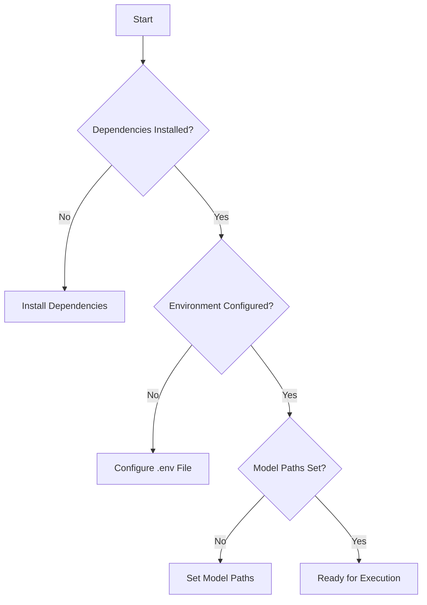
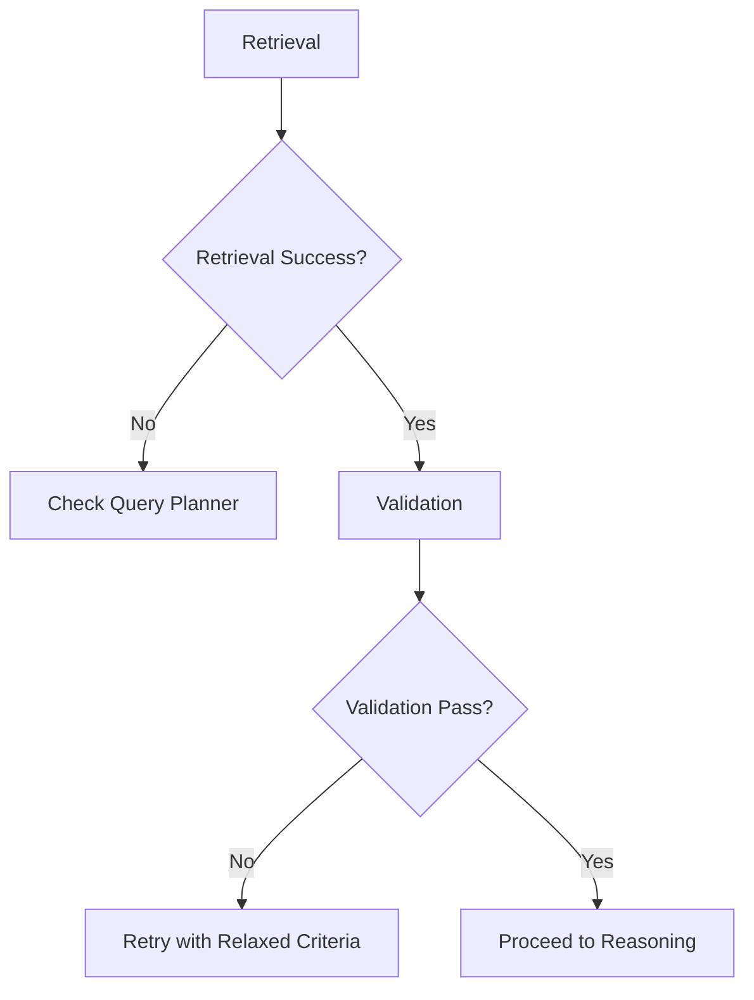
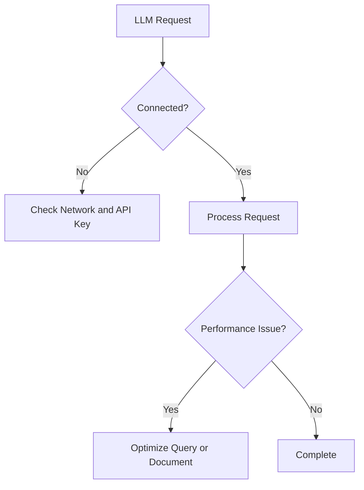
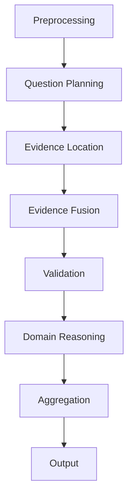

# Troubleshooting

<cite>
**Referenced Files in This Document**   
- [Milestones.md](file://docs/Milestones.md)
- [architecture.md](file://docs/architecture.md)
- [requirements.md](file://docs/requirements.md)
- [0001-docling-chunker-model.md](file://docs/adr/0001-docling-chunker-model.md)
- [0002-evidence-fusion-rrf.md](file://docs/adr/0002-evidence-fusion-rrf.md)
- [0003-validation-mode-and-completeness-relaxation.md](file://docs/adr/0003-validation-mode-and-completeness-relaxation.md)
- [0004-domain-risk-rule-tree.md](file://docs/adr/0004-domain-risk-rule-tree.md)
- [0005-domain-fulltext-audit-and-evidence-patching.md](file://docs/adr/0005-domain-fulltext-audit-and-evidence-patching.md)
- [rob2_graph.py](file://src/pipelines/graphs/rob2_graph.py)
- [rob2_runner.py](file://src/services/rob2_runner.py)
- [config.py](file://src/core/config.py)
- [app.py](file://src/cli/app.py)
- [shared.py](file://src/cli/commands/shared.py)
</cite>

## Table of Contents
1. [Introduction](#introduction)
2. [Common Installation and Configuration Issues](#common-installation-and-configuration-issues)
3. [Retrieval Failures and Validation Errors](#retrieval-failures-and-validation-errors)
4. [LLM Connectivity and Performance Issues](#llm-connectivity-and-performance-issues)
5. [Workflow Execution and Diagnostic Steps](#workflow-execution-and-diagnostic-steps)
6. [Known Limitations and Workarounds](#known-limitations-and-workarounds)
7. [Interpreting Error Messages and Logs](#interpreting-error-messages-and-logs)
8. [Escalation Paths for Unresolved Issues](#escalation-paths-for-unresolved-issues)

## Introduction

This troubleshooting guide provides comprehensive solutions for common issues encountered during the installation, configuration, and execution of the ROB2 automated risk of bias assessment system. The guide is based on architectural decisions documented in the ADRs, known issues, and system design principles. It covers diagnostic steps for identifying problems at different workflow stages, including retrieval failures, validation errors, and LLM connectivity issues. Additionally, it explains how to interpret error messages and logs, address performance bottlenecks, and work around known limitations documented in Milestones.md.

**Section sources**
- [Milestones.md](file://docs/Milestones.md)
- [architecture.md](file://docs/architecture.md)
- [requirements.md](file://docs/requirements.md)

## Common Installation and Configuration Issues

### Missing Dependencies
The system requires specific Python dependencies as defined in `pyproject.toml`. Ensure all dependencies are installed using `uv` or `pip`. Missing dependencies can lead to import errors during execution.

### Environment Configuration
Configuration is managed through `.env` files and environment variables. The default configuration file `.env.example` provides a template. Ensure all required environment variables are set, especially those related to LLM providers and retrieval models.

### Model Path Configuration
The system uses various models for retrieval and validation. Ensure the correct paths are configured for local models. For example, the SPLADE model path can be set via `SPLADE_MODEL_ID` or defaults to `models/splade_distil_CoCodenser_large` if available.

**Diagram sources**
- [pyproject.toml](file://pyproject.toml)
- [config.py](file://src/core/config.py)
- [.env.example](file://.env.example)

**Section sources**
- [pyproject.toml](file://pyproject.toml)
- [config.py](file://src/core/config.py)
- [.env.example](file://.env.example)

## Retrieval Failures and Validation Errors

### Retrieval Failures
Retrieval failures can occur due to incorrect query planning or model issues. The system uses multiple retrieval engines (BM25, Dense, SPLADE) with rank fusion (RRF) for evidence location. Ensure the query planner is correctly configured and the retrieval models are accessible.

### Validation Errors
Validation errors are common during evidence verification. The system employs multiple validators:
- **Existence Validator**: Checks if evidence exists in the document.
- **Relevance Validator**: Ensures evidence is relevant to the query.
- **Consistency Validator**: Checks for consistency across evidence.
- **Completeness Validator**: Ensures all required evidence is present.

Validation failures trigger a retry mechanism with relaxed criteria if `validation_relax_on_retry` is enabled. This includes lowering confidence thresholds and disabling strict text matching.

**Diagram sources**
- [rob2_graph.py](file://src/pipelines/graphs/rob2_graph.py)
- [rob2_runner.py](file://src/services/rob2_runner.py)

**Section sources**
- [rob2_graph.py](file://src/pipelines/graphs/rob2_graph.py)
- [rob2_runner.py](file://src/services/rob2_runner.py)
- [0003-validation-mode-and-completeness-relaxation.md](file://docs/adr/0003-validation-mode-and-completeness-relaxation.md)

## LLM Connectivity and Performance Issues

### LLM Connectivity
The system relies on LLMs for various tasks, including query planning and domain reasoning. Ensure the LLM provider is correctly configured and accessible. Network issues or incorrect API keys can lead to connectivity problems.

### Performance Bottlenecks
Performance issues can arise from large document sizes or complex queries. The system uses parallel processing for evidence location and validation. Monitor resource usage and consider optimizing query complexity or document size.

**Diagram sources**
- [config.py](file://src/core/config.py)
- [rob2_runner.py](file://src/services/rob2_runner.py)

**Section sources**
- [config.py](file://src/core/config.py)
- [rob2_runner.py](file://src/services/rob2_runner.py)

## Workflow Execution and Diagnostic Steps

### Diagnostic Steps
To diagnose issues in the workflow:
1. **Check Logs**: Enable debug mode to get detailed logs.
2. **Validate Inputs**: Ensure the PDF and configuration are correct.
3. **Test Components**: Use CLI commands to test individual components like retrieval and validation.

### Execution Flow
The workflow follows a structured flow from document preprocessing to final aggregation. Each step is designed to be modular and testable. Use the CLI to run specific components and verify their output.

**Diagram sources**
- [architecture.md](file://docs/architecture.md)
- [rob2_graph.py](file://src/pipelines/graphs/rob2_graph.py)

**Section sources**
- [architecture.md](file://docs/architecture.md)
- [rob2_graph.py](file://src/pipelines/graphs/rob2_graph.py)

## Known Limitations and Workarounds

### Known Limitations
- **Document Parsing**: The system relies on Docling for PDF parsing. Complex layouts may not be parsed correctly.
- **LLM Dependencies**: The system's performance is dependent on the availability and performance of external LLMs.
- **Resource Intensive**: The system can be resource-intensive, especially with large documents.

### Workarounds
- **Document Parsing**: Use the `DOCLING_CHUNKER_MODEL` environment variable to switch to a different chunking model if parsing issues occur.
- **LLM Failures**: Implement retry logic and fallback models.
- **Resource Constraints**: Optimize document size and query complexity to reduce resource usage.

**Section sources**
- [Milestones.md](file://docs/Milestones.md)
- [0001-docling-chunker-model.md](file://docs/adr/0001-docling-chunker-model.md)

## Interpreting Error Messages and Logs

### Error Messages
Error messages are designed to be descriptive and include context. Common error types include:
- **Configuration Errors**: Indicate missing or incorrect configuration.
- **Retrieval Errors**: Indicate issues with evidence location.
- **Validation Errors**: Indicate issues with evidence verification.

### Logs
Logs provide detailed information about the execution flow. Enable debug mode to get comprehensive logs. Key log entries include:
- **Validation Attempts**: Track the number of validation retries.
- **Component Outputs**: Monitor the output of each component for anomalies.

**Section sources**
- [rob2_runner.py](file://src/services/rob2_runner.py)
- [rob2_graph.py](file://src/pipelines/graphs/rob2_graph.py)

## Escalation Paths for Unresolved Issues

### Internal Escalation
For unresolved issues, escalate within the development team. Provide detailed logs and error messages to facilitate debugging.

### External Support
If the issue involves external dependencies (e.g., LLM providers), contact the respective support teams. Ensure all configuration and network issues are ruled out before escalation.

**Section sources**
- [rob2_runner.py](file://src/services/rob2_runner.py)
- [config.py](file://src/core/config.py)