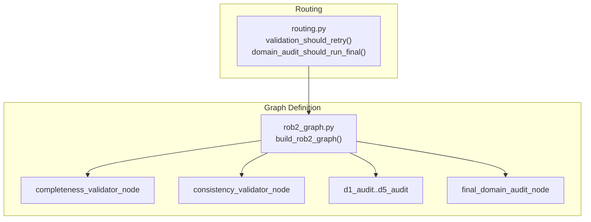
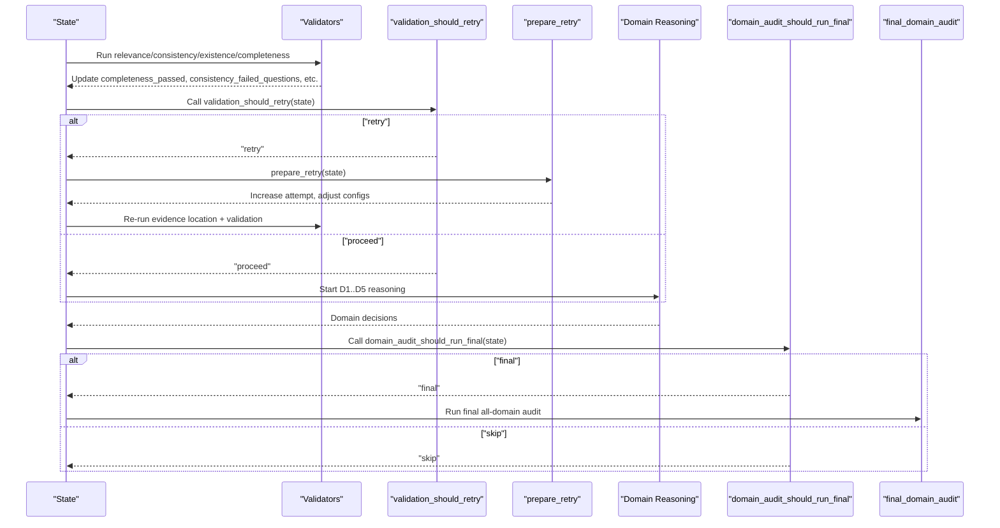
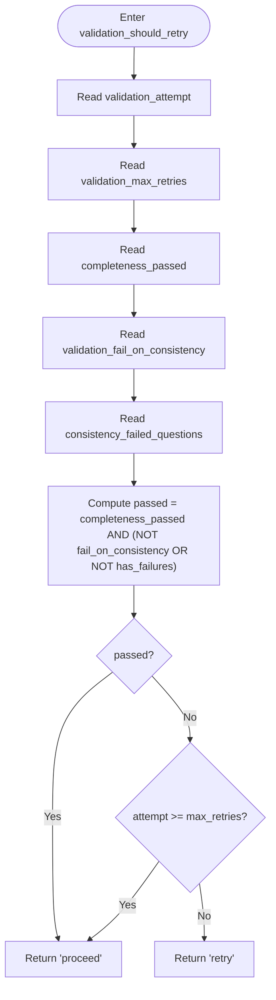
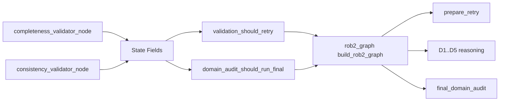

# Conditional Routing

<cite>
**Referenced Files in This Document**
- [routing.py](file://src/pipelines/graphs/routing.py)
- [rob2_graph.py](file://src/pipelines/graphs/rob2_graph.py)
- [test_validation_routing.py](file://tests/unit/test_validation_routing.py)
- [test_rob2_workflow_retry.py](file://tests/integration/test_rob2_workflow_retry.py)
- [domain_audit.py](file://src/pipelines/graphs/nodes/domain_audit.py)
- [completeness.py](file://src/pipelines/graphs/nodes/validators/completeness.py)
- [consistency.py](file://src/pipelines/graphs/nodes/validators/consistency.py)
- [rob2_runner.py](file://src/services/rob2_runner.py)
- [0003-validation-mode-and-completeness-relaxation.md](file://docs/adr/0003-validation-mode-and-completeness-relaxation.md)
</cite>

## Table of Contents
1. [Introduction](#introduction)
2. [Project Structure](#project-structure)
3. [Core Components](#core-components)
4. [Architecture Overview](#architecture-overview)
5. [Detailed Component Analysis](#detailed-component-analysis)
6. [Dependency Analysis](#dependency-analysis)
7. [Performance Considerations](#performance-considerations)
8. [Troubleshooting Guide](#troubleshooting-guide)
9. [Conclusion](#conclusion)

## Introduction
This document explains the conditional routing system in the ROB2 workflow, focusing on two key routing functions:
- validation_should_retry: determines whether to retry the evidence location and validation stage or proceed to domain reasoning.
- domain_audit_should_run_final: decides whether to run a final all-domain audit after per-domain audits.

It details how these functions evaluate the current state to control workflow progression, how validation failures trigger retry loops, and how final audit steps are conditionally executed. It also documents the return value mappings and their impact on execution, and provides best practices for configuring retry thresholds and audit conditions.

## Project Structure
The conditional routing logic lives in routing.py and is wired into the ROB2 graph in rob2_graph.py. The validators produce state fields consumed by the routing functions, and the domain audit nodes implement the optional final audit step.

**Diagram sources**
- [routing.py](file://src/pipelines/graphs/routing.py#L28-L57)
- [rob2_graph.py](file://src/pipelines/graphs/rob2_graph.py#L380-L423)
- [completeness.py](file://src/pipelines/graphs/nodes/validators/completeness.py#L20-L140)
- [consistency.py](file://src/pipelines/graphs/nodes/validators/consistency.py#L17-L159)
- [domain_audit.py](file://src/pipelines/graphs/nodes/domain_audit.py#L98-L122)

**Section sources**
- [routing.py](file://src/pipelines/graphs/routing.py#L1-L58)
- [rob2_graph.py](file://src/pipelines/graphs/rob2_graph.py#L1-L426)

## Core Components
- validation_should_retry(state): Evaluates completeness and consistency outcomes plus retry budget to decide "retry" or "proceed".
- domain_audit_should_run_final(state): Checks audit mode and a flag to decide "final" or "skip" for the optional all-domain audit.

These functions are imported and used by the graph builder to add conditional edges after validation and after per-domain audits.

**Section sources**
- [routing.py](file://src/pipelines/graphs/routing.py#L28-L57)
- [rob2_graph.py](file://src/pipelines/graphs/rob2_graph.py#L395-L416)

## Architecture Overview
The ROB2 graph orchestrates evidence location, validation, domain reasoning, and optional final audit. Conditional edges route based on the routing functions’ return values.

**Diagram sources**
- [rob2_graph.py](file://src/pipelines/graphs/rob2_graph.py#L395-L416)
- [routing.py](file://src/pipelines/graphs/routing.py#L28-L57)
- [domain_audit.py](file://src/pipelines/graphs/nodes/domain_audit.py#L246-L297)

## Detailed Component Analysis

### validation_should_retry
Purpose:
- After validation, decide whether to retry the evidence location/validation stage or proceed to domain reasoning.

Behavior:
- Reads:
  - validation_attempt
  - validation_max_retries
  - completeness_passed
  - validation_fail_on_consistency
  - consistency_failed_questions
- Logic:
  - If completeness_passed AND (not fail_on_consistency OR no consistency failures) => "proceed"
  - Else if attempt >= max_retries => "proceed"
  - Else => "retry"

Impact on execution:
- "retry" triggers prepare_retry, which increments validation_attempt and applies retry relaxation (e.g., adjusting top_k/per_query_top_n and optionally relaxing relevance/quote requirements).
- "proceed" continues to domain reasoning.

Return value mapping:
- {"retry": "prepare_retry", "proceed": "d1_randomization"}

Integration with add_conditional_edges:
- The graph adds a conditional edge from the completeness validator to validation_should_retry, then routes to "prepare_retry" or "d1_randomization".

Common scenarios:
- Passed validation => "proceed" and workflow proceeds to domain reasoning.
- Failed validation but retries left => "retry" and the workflow loops back to evidence location with adjusted parameters.
- Failed validation and retries exhausted => "proceed" and workflow proceeds to domain reasoning.

**Section sources**
- [routing.py](file://src/pipelines/graphs/routing.py#L28-L44)
- [rob2_graph.py](file://src/pipelines/graphs/rob2_graph.py#L395-L401)
- [test_validation_routing.py](file://tests/unit/test_validation_routing.py#L1-L79)
- [test_rob2_workflow_retry.py](file://tests/integration/test_rob2_workflow_retry.py#L120-L278)

#### validation_should_retry Decision Flow

**Diagram sources**
- [routing.py](file://src/pipelines/graphs/routing.py#L28-L44)

### _prepare_validation_retry_node
Purpose:
- Prepare the next iteration of validation by updating retry counters and relaxation parameters.

Behavior:
- Increments validation_attempt.
- On first retry, disables structure-aware retrieval if previously enabled.
- On subsequent retries, increases per_query_top_n and top_k gradually and caps them.
- Optionally relaxes validation criteria when validation_relax_on_retry is true (e.g., lowering relevance_min_confidence, disabling strict quote/text requirements).

Impact on execution:
- These adjustments increase recall and reduce strictness to help recover from transient failures.

**Section sources**
- [rob2_graph.py](file://src/pipelines/graphs/rob2_graph.py#L248-L286)

### domain_audit_should_run_final
Purpose:
- After per-domain audits, decide whether to run a final all-domain audit.

Behavior:
- Reads domain_audit_mode and domain_audit_final.
- If mode is "none" (or falsy), skip.
- Otherwise, if domain_audit_final is truthy, run final; otherwise skip.

Return value mapping:
- {"final": "final_domain_audit", "skip": "aggregate"}

Integration with add_conditional_edges:
- The graph adds a conditional edge from the last domain audit to domain_audit_should_run_final, routing to either the final audit or aggregation.

**Section sources**
- [routing.py](file://src/pipelines/graphs/routing.py#L46-L54)
- [rob2_graph.py](file://src/pipelines/graphs/rob2_graph.py#L410-L416)
- [domain_audit.py](file://src/pipelines/graphs/nodes/domain_audit.py#L246-L297)

### Validators and Their Role in Routing
- completeness_validator_node sets completeness_passed and completeness_failed_questions.
- consistency_validator_node sets consistency_failed_questions and related metadata.

These outputs feed into validation_should_retry to determine retry/proceed.

**Section sources**
- [completeness.py](file://src/pipelines/graphs/nodes/validators/completeness.py#L20-L140)
- [consistency.py](file://src/pipelines/graphs/nodes/validators/consistency.py#L17-L159)

### Graph Wiring and Conditional Edges
- After completeness_validator, the graph uses validation_should_retry to route to "prepare_retry" or "d1_randomization".
- After d5_audit, the graph uses domain_audit_should_run_final to route to "final_domain_audit" or "aggregate".

**Section sources**
- [rob2_graph.py](file://src/pipelines/graphs/rob2_graph.py#L395-L416)

## Dependency Analysis
The routing functions depend on state fields populated by validators and the graph initialization node. The graph builder wires these functions into conditional edges.

**Diagram sources**
- [rob2_graph.py](file://src/pipelines/graphs/rob2_graph.py#L380-L423)
- [routing.py](file://src/pipelines/graphs/routing.py#L28-L57)
- [completeness.py](file://src/pipelines/graphs/nodes/validators/completeness.py#L20-L140)
- [consistency.py](file://src/pipelines/graphs/nodes/validators/consistency.py#L17-L159)
- [domain_audit.py](file://src/pipelines/graphs/nodes/domain_audit.py#L246-L297)

**Section sources**
- [rob2_graph.py](file://src/pipelines/graphs/rob2_graph.py#L380-L423)
- [routing.py](file://src/pipelines/graphs/routing.py#L28-L57)

## Performance Considerations
- The graph intentionally increases recursion_limit to accommodate potential retry loops.
- Retries increase computational cost; tune validation_max_retries and relaxation parameters to balance robustness and latency.
- Domain audit final step is optional; enabling it adds extra LLM calls.

**Section sources**
- [rob2_graph.py](file://src/pipelines/graphs/rob2_graph.py#L418-L423)

## Troubleshooting Guide

Common issues and solutions:

- Infinite retry loops
  - Symptom: Workflow keeps looping between evidence location and validation without progressing.
  - Causes:
    - validation_max_retries too high or not set, combined with persistent validation failures.
    - validation_relax_on_retry disabled while strict criteria remain unchanged.
  - Solutions:
    - Set a bounded validation_max_retries appropriate for your workload.
    - Enable validation_relax_on_retry so that retries automatically relax criteria.
    - Ensure completeness_require_relevance aligns with relevance_mode to avoid blocking evidence selection when relevance_mode is "none".

- Incorrect audit triggering
  - Symptom: Final audit runs unexpectedly or not at all.
  - Causes:
    - domain_audit_mode set to "none" or falsy, causing skip.
    - domain_audit_final not enabled, causing skip.
  - Solutions:
    - Set domain_audit_mode to "llm" to enable.
    - Set domain_audit_final to truthy to trigger the final audit.

- Validation fails due to consistency
  - Symptom: validation_should_retry returns "retry" even though completeness seems fine.
  - Causes:
    - validation_fail_on_consistency is true and consistency_failed_questions is non-empty.
  - Solutions:
    - Disable validation_fail_on_consistency if you want to proceed despite consistency issues.
    - Fix underlying inconsistencies or adjust consistency thresholds.

- No progress after retries exhausted
  - Symptom: Workflow proceeds to domain reasoning even though validation failed.
  - Explanation: validation_should_retry returns "proceed" when attempt >= max_retries.
  - Solutions:
    - Increase validation_max_retries if legitimate recovery is expected.
    - Investigate why validation keeps failing and adjust upstream retrievers or validators.

Best practices:
- Configure validation_max_retries conservatively to avoid long loops.
- Enable validation_relax_on_retry to improve resilience during retries.
- Align completeness_require_relevance with relevance_mode to prevent blocking evidence selection.
- Use domain_audit_final only when you need a comprehensive post-check across all domains.

**Section sources**
- [routing.py](file://src/pipelines/graphs/routing.py#L28-L57)
- [rob2_graph.py](file://src/pipelines/graphs/rob2_graph.py#L216-L286)
- [test_validation_routing.py](file://tests/unit/test_validation_routing.py#L1-L79)
- [test_rob2_workflow_retry.py](file://tests/integration/test_rob2_workflow_retry.py#L120-L278)
- [0003-validation-mode-and-completeness-relaxation.md](file://docs/adr/0003-validation-mode-and-completeness-relaxation.md#L1-L20)

## Conclusion
The conditional routing system in ROB2 uses two focused functions to govern workflow progression:
- validation_should_retry controls retry loops based on validation outcomes and budget.
- domain_audit_should_run_final conditionally executes a final all-domain audit.

By tuning validation_max_retries, validation_relax_on_retry, and audit flags, you can balance robustness, performance, and correctness. The provided tests and integration examples demonstrate expected behavior and serve as a guide for configuration and troubleshooting.