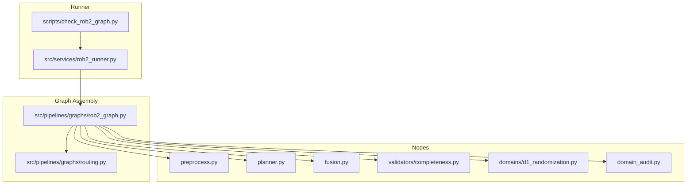
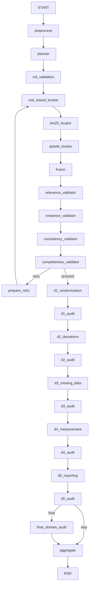
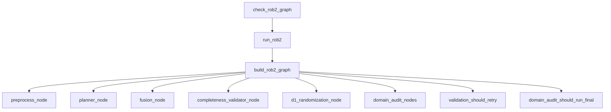
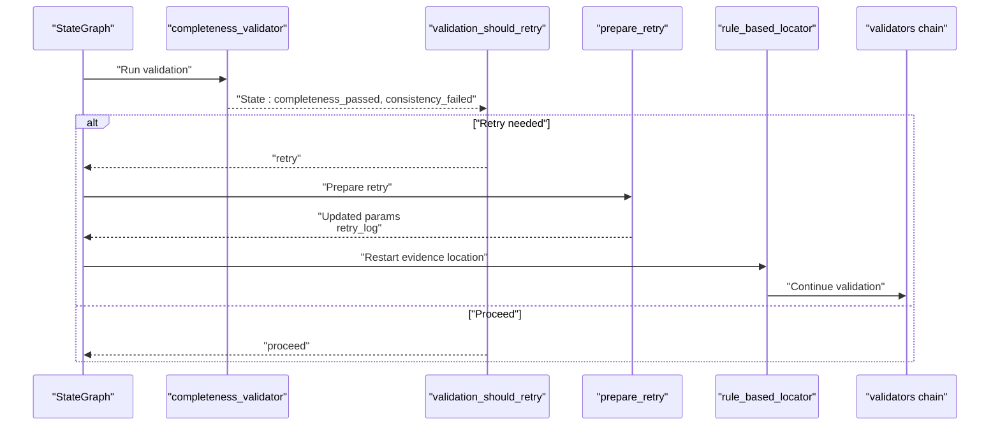
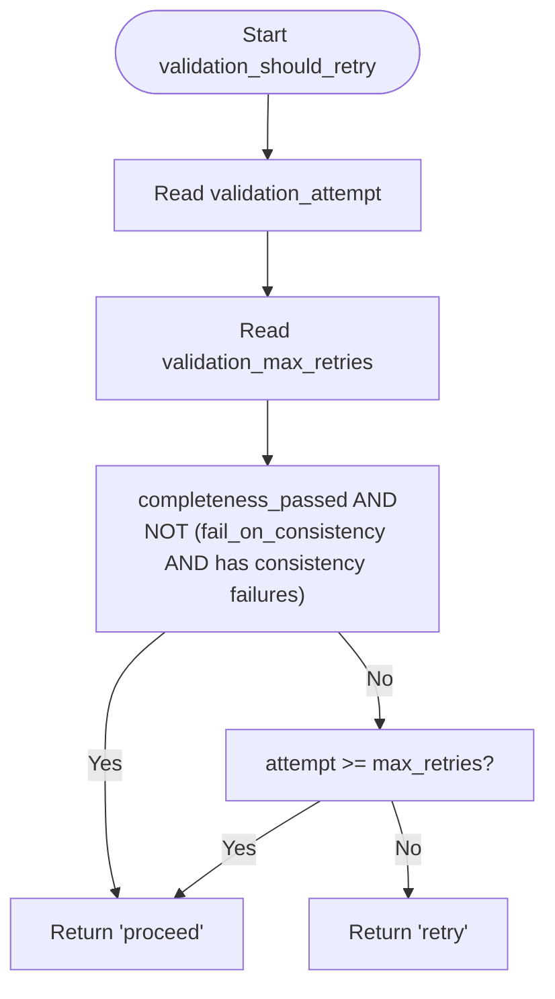

# Node Orchestration

<cite>
**Referenced Files in This Document**
- [rob2_graph.py](file://src/pipelines/graphs/rob2_graph.py)
- [routing.py](file://src/pipelines/graphs/routing.py)
- [rob2_runner.py](file://src/services/rob2_runner.py)
- [check_rob2_graph.py](file://scripts/check_rob2_graph.py)
- [preprocess.py](file://src/pipelines/graphs/nodes/preprocess.py)
- [planner.py](file://src/pipelines/graphs/nodes/planner.py)
- [fusion.py](file://src/pipelines/graphs/nodes/fusion.py)
- [completeness.py](file://src/pipelines/graphs/nodes/validators/completeness.py)
- [d1_randomization.py](file://src/pipelines/graphs/nodes/domains/d1_randomization.py)
- [domain_audit.py](file://src/pipelines/graphs/nodes/domain_audit.py)
- [test_rob2_workflow_retry.py](file://tests/integration/test_rob2_workflow_retry.py)
</cite>

## Table of Contents
1. [Introduction](#introduction)
2. [Project Structure](#project-structure)
3. [Core Components](#core-components)
4. [Architecture Overview](#architecture-overview)
5. [Detailed Component Analysis](#detailed-component-analysis)
6. [Dependency Analysis](#dependency-analysis)
7. [Performance Considerations](#performance-considerations)
8. [Troubleshooting Guide](#troubleshooting-guide)
9. [Conclusion](#conclusion)
10. [Appendices](#appendices)

## Introduction
This document explains the node orchestration mechanism in the ROB2 workflow. It focuses on how the build_rob2_graph function registers nodes, defines edges, and implements conditional routing for validation retries. It also details the execution sequence from START to END, the roles of special internal nodes init_validation and prepare_retry, and how node overrides are handled. Finally, it addresses the recursion limit configuration and guidance for extending the graph.

## Project Structure
The ROB2 workflow is assembled in a single module that composes nodes and routing logic into a StateGraph. The runner service constructs the initial state and invokes the compiled graph.

**Diagram sources**
- [rob2_graph.py](file://src/pipelines/graphs/rob2_graph.py#L288-L423)
- [routing.py](file://src/pipelines/graphs/routing.py#L1-L58)
- [rob2_runner.py](file://src/services/rob2_runner.py#L41-L71)
- [check_rob2_graph.py](file://scripts/check_rob2_graph.py#L1-L173)

**Section sources**
- [rob2_graph.py](file://src/pipelines/graphs/rob2_graph.py#L1-L426)
- [rob2_runner.py](file://src/services/rob2_runner.py#L1-L443)
- [check_rob2_graph.py](file://scripts/check_rob2_graph.py#L1-L173)

## Core Components
- StateGraph builder: Registers nodes and edges, compiles the graph, and sets recursion limit.
- Routing helpers: validation_should_retry and domain_audit_should_run_final decide conditional branches.
- Runner service: Normalizes options, builds state, and invokes the graph.
- Example script: Demonstrates CLI usage and prints validation retry logs.

Key responsibilities:
- Node registration via add_node with optional overrides.
- Linear edges for preprocessing, planning, evidence location, fusion, and validation.
- Conditional edges for retry and domain audit branching.
- Internal nodes init_validation and prepare_retry manage retry state and adaptive parameters.

**Section sources**
- [rob2_graph.py](file://src/pipelines/graphs/rob2_graph.py#L288-L423)
- [routing.py](file://src/pipelines/graphs/routing.py#L28-L55)
- [rob2_runner.py](file://src/services/rob2_runner.py#L41-L71)
- [check_rob2_graph.py](file://scripts/check_rob2_graph.py#L98-L171)

## Architecture Overview
The ROB2 workflow orchestrates a linear pipeline with a retry loop and optional domain audits. The graph is built programmatically and executed by LangGraph.

**Diagram sources**
- [rob2_graph.py](file://src/pipelines/graphs/rob2_graph.py#L382-L416)
- [routing.py](file://src/pipelines/graphs/routing.py#L28-L55)

## Detailed Component Analysis

### build_rob2_graph: Node Registration, Edges, and Conditional Routing
- Node registration:
  - Uses builder.add_node for each node, with overrides resolved from node_overrides. Keys correspond to node names (e.g., "preprocess", "planner", "fusion").
  - Special internal nodes: init_validation and prepare_retry are registered directly.
- Edge definitions:
  - Linear progression from START to END via add_edge calls.
  - Evidence location chain: rule-based → BM25 → SPLADE → fusion.
  - Validation chain: relevance → existence → consistency → completeness.
  - Domain reasoning chain: D1 → D1 audit → D2 → D2 audit → D3 → D3 audit → D4 → D4 audit → D5 → D5 audit.
- Conditional routing:
  - After completeness_validator, validation_should_retry decides retry vs proceed.
  - After D5 audit, domain_audit_should_run_final decides final audit vs skip to aggregation.
- Recursion limit:
  - The compiled graph is wrapped with recursion_limit=100 to accommodate the retry loop plus downstream nodes.

Concrete examples of node overrides:
- The integration test demonstrates overriding multiple nodes (preprocess, planner, rule-based locator, BM25/splade empty locators, and domain reasoning nodes) to simulate deterministic behavior and measure retry effects.

**Section sources**
- [rob2_graph.py](file://src/pipelines/graphs/rob2_graph.py#L288-L423)
- [routing.py](file://src/pipelines/graphs/routing.py#L28-L55)
- [test_rob2_workflow_retry.py](file://tests/integration/test_rob2_workflow_retry.py#L224-L278)

### Execution Sequence: START to END
- Preprocessing: Converts PDF to a normalized document structure.
- Planning: Supplies the standardized question set.
- Init validation: Initializes retry-related state fields.
- Evidence location: Applies rule-based, BM25, and SPLADE retrieval; merges into fusion.
- Validation: Applies relevance, existence, consistency, and completeness checks.
- Retry loop: If validation fails, prepare_retry adapts parameters and restarts evidence location.
- Domain reasoning: Executes domain-specific agents in order.
- Domain audit: Optionally runs per-domain audits; may run a final all-domain audit.
- Aggregation: Produces final results.

**Section sources**
- [rob2_graph.py](file://src/pipelines/graphs/rob2_graph.py#L382-L416)
- [preprocess.py](file://src/pipelines/graphs/nodes/preprocess.py#L28-L37)
- [planner.py](file://src/pipelines/graphs/nodes/planner.py#L8-L12)
- [fusion.py](file://src/pipelines/graphs/nodes/fusion.py#L16-L84)
- [completeness.py](file://src/pipelines/graphs/nodes/validators/completeness.py#L20-L126)
- [domain_audit.py](file://src/pipelines/graphs/nodes/domain_audit.py#L98-L244)

### Special Internal Nodes: init_validation and prepare_retry
- init_validation:
  - Ensures retry-related fields are initialized (attempt, max_retries, fail_on_consistency, relax_on_retry, retry log, domain audit flags).
  - Adjusts completeness requirement based on relevance mode.
- prepare_retry:
  - Increments attempt and records a retry log entry.
  - Adapts evidence search parameters (e.g., disables structure-awareness on first retry, increases per_query_top_n and top_k, and relaxes validation constraints on subsequent retries).
  - Returns updates that influence subsequent evidence location and validation.

These nodes enable the retry loop and stateful adaptation during validation failures.

**Section sources**
- [rob2_graph.py](file://src/pipelines/graphs/rob2_graph.py#L216-L245)
- [rob2_graph.py](file://src/pipelines/graphs/rob2_graph.py#L248-L286)
- [routing.py](file://src/pipelines/graphs/routing.py#L28-L44)

### Node Overrides via node_overrides
- Purpose: Allow swapping out default nodes with custom implementations for testing, experimentation, or specialized behavior.
- Mechanism: build_rob2_graph accepts node_overrides as a mapping from node name to callable. Overrides are resolved using overrides.get(node_name) or fall back to the default node.
- Example usage: The integration test passes a dictionary of node overrides to build_rob2_graph to stub out preprocessing, planning, and domain reasoning nodes while keeping others intact.

Guidance:
- Override only the nodes you need to change.
- Ensure the override callable has the same signature as the original node (accepts state dict, returns dict).
- Keep the override keys consistent with the node names used in the graph.

**Section sources**
- [rob2_graph.py](file://src/pipelines/graphs/rob2_graph.py#L288-L311)
- [test_rob2_workflow_retry.py](file://tests/integration/test_rob2_workflow_retry.py#L224-L237)

### Recursion Limit Configuration (100)
- Reason: The graph includes an intentional retry loop after validation. With additional downstream nodes (Milestone 8 and optional Milestone 9), a single retry can exceed LangGraph’s default recursion limit (25).
- Implementation: The compiled graph is wrapped with recursion_limit=100 before returning.

Practical impact:
- Prevents false positives from recursion depth exceeded errors.
- Allows safe execution of retry loops plus domain audits.

**Section sources**
- [rob2_graph.py](file://src/pipelines/graphs/rob2_graph.py#L418-L423)

### Extending the Graph: Adding New Nodes and Modifying Paths
- Add a new node:
  - Implement the node function with the standard signature (state dict -> dict).
  - Register it with builder.add_node and give it a unique name.
- Insert into the linear pipeline:
  - Add an edge from the previous node to the new node using builder.add_edge.
- Conditional branching:
  - Use builder.add_conditional_edges with a routing function to decide between multiple next steps.
- Internal state:
  - If the node needs to initialize or update state fields, ensure the node returns the appropriate keys so downstream nodes can consume them.
- Testing overrides:
  - Pass node_overrides to build_rob2_graph to inject your new node during tests or demos.

Examples from the codebase:
- Adding a new domain reasoning node follows the same pattern as existing domain nodes (e.g., d1_randomization).
- Domain audit nodes demonstrate how to integrate optional final auditing after domain reasoning.

**Section sources**
- [rob2_graph.py](file://src/pipelines/graphs/rob2_graph.py#L288-L416)
- [d1_randomization.py](file://src/pipelines/graphs/nodes/domains/d1_randomization.py#L15-L47)
- [domain_audit.py](file://src/pipelines/graphs/nodes/domain_audit.py#L98-L122)

## Dependency Analysis
The graph depends on routing helpers and individual nodes. The runner service constructs state and invokes the graph.

**Diagram sources**
- [rob2_graph.py](file://src/pipelines/graphs/rob2_graph.py#L288-L423)
- [routing.py](file://src/pipelines/graphs/routing.py#L28-L55)
- [rob2_runner.py](file://src/services/rob2_runner.py#L41-L71)
- [check_rob2_graph.py](file://scripts/check_rob2_graph.py#L98-L171)

**Section sources**
- [rob2_graph.py](file://src/pipelines/graphs/rob2_graph.py#L288-L423)
- [routing.py](file://src/pipelines/graphs/routing.py#L28-L55)
- [rob2_runner.py](file://src/services/rob2_runner.py#L41-L71)
- [check_rob2_graph.py](file://scripts/check_rob2_graph.py#L98-L171)

## Performance Considerations
- Evidence search parameters adapt during retries to reduce false negatives while controlling cost and latency.
- Fusion parameters (top_k, rrf_k, engine weights) influence recall and ranking quality.
- Domain audit patching and reruns can increase computation; tune patch window and max patches accordingly.

[No sources needed since this section provides general guidance]

## Troubleshooting Guide
Common issues and remedies:
- Validation keeps failing and retry loop does not trigger:
  - Verify validation_should_retry conditions: completeness_passed and fail_on_consistency.
  - Ensure validation_max_retries is set appropriately.
- Retry loop exceeds recursion limit:
  - Confirm recursion_limit is set to 100 in the compiled graph.
- Domain audit not running:
  - Check domain_audit_mode and domain_audit_final flags.
- Missing LLM models for domain reasoning or audit:
  - Provide model configuration or pass llm instances in state.

**Section sources**
- [routing.py](file://src/pipelines/graphs/routing.py#L28-L55)
- [rob2_graph.py](file://src/pipelines/graphs/rob2_graph.py#L418-L423)
- [domain_audit.py](file://src/pipelines/graphs/nodes/domain_audit.py#L329-L378)

## Conclusion
The ROB2 workflow is a robust, extensible StateGraph that orchestrates preprocessing, planning, evidence location, fusion, validation, domain reasoning, and optional full-text audit. The build_rob2_graph function centralizes node registration, edge definitions, and conditional routing, while internal nodes manage retry state and adaptive parameters. The recursion limit is intentionally raised to support the retry loop and downstream nodes. Node overrides enable flexible experimentation and testing, and the architecture supports straightforward extension for new nodes and execution paths.

## Appendices

### Sequence Diagram: Retry Loop Flow

**Diagram sources**
- [rob2_graph.py](file://src/pipelines/graphs/rob2_graph.py#L395-L401)
- [routing.py](file://src/pipelines/graphs/routing.py#L28-L44)
- [rob2_graph.py](file://src/pipelines/graphs/rob2_graph.py#L248-L286)

### Flowchart: Retry Decision Logic

**Diagram sources**
- [routing.py](file://src/pipelines/graphs/routing.py#L28-L44)