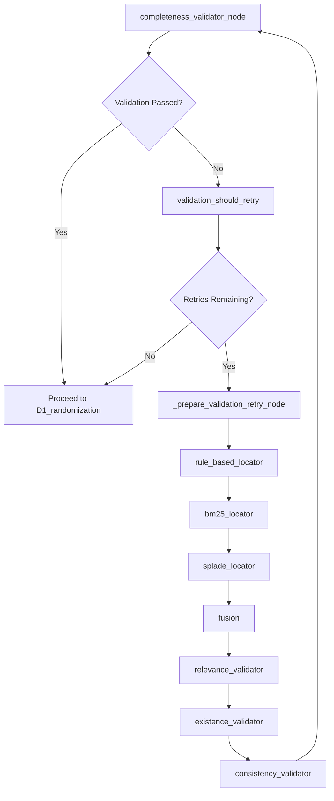
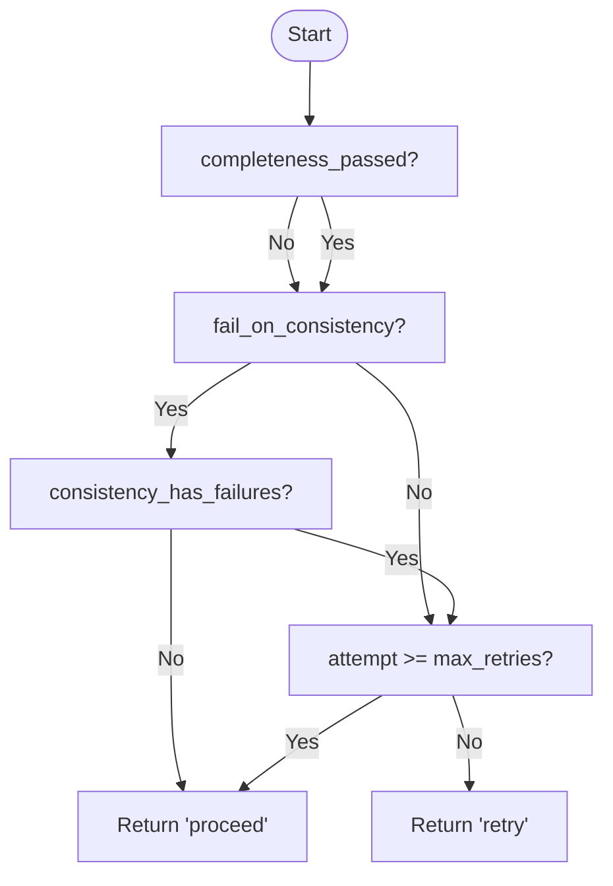

# Retry Mechanism

<cite>
**Referenced Files in This Document**   
- [rob2_graph.py](file://src/pipelines/graphs/rob2_graph.py#L216-L271)
- [routing.py](file://src/pipelines/graphs/routing.py#L28-L43)
- [completeness.py](file://src/pipelines/graphs/nodes/validators/completeness.py#L20-L116)
- [relevance.py](file://src/pipelines/graphs/nodes/validators/relevance.py#L24-L192)
- [consistency.py](file://src/pipelines/graphs/nodes/validators/consistency.py#L17-L130)
- [rob2_graph.py](file://src/pipelines/graphs/rob2_graph.py#L395-L399)
- [rob2_runner.py](file://src/services/rob2_runner.py#L355-L367)
- [0003-validation-mode-and-completeness-relaxation.md](file://docs/adr/0003-validation-mode-and-completeness-relaxation.md)
</cite>

## Table of Contents
1. [Introduction](#introduction)
2. [Validation Retry Cycle](#validation-retry-cycle)
3. [Initialization of Retry State](#initialization-of-retry-state)
4. [Conditional Routing After Validation](#conditional-routing-after-validation)
5. [Retry Preparation and Configuration Adjustment](#retry-preparation-and-configuration-adjustment)
6. [Progressive Relaxation Strategy](#progressive-relaxation-strategy)
7. [Configuration Parameters](#configuration-parameters)
8. [Logging and Debugging](#logging-and-debugging)
9. [Retry Scenarios and Best Practices](#retry-scenarios-and-best-practices)

## Introduction
The ROB2 workflow incorporates a robust validation retry mechanism designed to enhance evidence retrieval reliability when initial validation fails. This mechanism enables the system to automatically rollback to the evidence location phase, adjust retrieval and validation configurations, and reattempt the process. The retry logic is orchestrated through LangGraph's conditional routing, state management, and node execution, ensuring resilience in complex document analysis tasks. This document details the implementation and operation of the retry mechanism, focusing on the `_init_validation_state_node` and `_prepare_validation_retry_node` functions, the complete retry cycle, and the progressive relaxation strategy.

## Validation Retry Cycle
The validation retry cycle in the ROB2 workflow is a closed-loop process that begins with evidence validation and can trigger a rollback to evidence location upon failure. The cycle is initiated after the `completeness_validator_node` executes, which evaluates whether sufficient and valid evidence has been retrieved for all questions. If validation fails and retry attempts remain, the workflow routes to the `prepare_retry` node, which adjusts configuration parameters. The process then rolls back to the `rule_based_locator` node, restarting the evidence location phase with the updated configuration. This cycle continues until validation passes or the maximum retry limit is reached.

**Diagram sources**
- [rob2_graph.py](file://src/pipelines/graphs/rob2_graph.py#L395-L399)
- [routing.py](file://src/pipelines/graphs/routing.py#L28-L43)

**Section sources**
- [rob2_graph.py](file://src/pipelines/graphs/rob2_graph.py#L395-L399)
- [routing.py](file://src/pipelines/graphs/routing.py#L28-L43)

## Initialization of Retry State
The retry mechanism begins with the `_init_validation_state_node` function, which initializes the state variables required for managing retries. This function sets default values for key retry parameters if they are not already present in the state. It initializes `validation_attempt` to 0, `validation_max_retries` to 1, and `validation_fail_on_consistency` to True. The `validation_relax_on_retry` flag is set to True by default, enabling the progressive relaxation strategy on retry. Additionally, it initializes an empty `validation_retry_log` list to record details of each retry attempt. This function ensures that the retry system starts with a consistent and predictable state, regardless of external input.

**Section sources**
- [rob2_graph.py](file://src/pipelines/graphs/rob2_graph.py#L216-L245)

## Conditional Routing After Validation
After the validation phase, the `validation_should_retry` routing function determines whether the workflow should proceed to domain reasoning or retry evidence location. This decision is based on three primary conditions: validation success, consistency failure, and retry budget. The function first checks if `completeness_passed` is True and, if `validation_fail_on_consistency` is enabled, ensures no consistency failures exist. If validation passes, it routes to "proceed". If validation fails, it checks if the current `validation_attempt` is less than `validation_max_retries`. If retries remain, it routes to "retry"; otherwise, it proceeds to the next phase. This logic ensures that the system only retries when both validation has failed and retry attempts are available.

**Diagram sources**
- [routing.py](file://src/pipelines/graphs/routing.py#L28-L43)

**Section sources**
- [routing.py](file://src/pipelines/graphs/routing.py#L28-L43)

## Retry Preparation and Configuration Adjustment
When a retry is triggered, the `_prepare_validation_retry_node` function executes to prepare the system for the next attempt. This function increments the `validation_attempt` counter and calculates configuration updates to improve retrieval success. It disables `use_structure` on the first retry to bypass structure-aware retrieval, which may be too restrictive. It increases `per_query_top_n` and `top_k` values to retrieve more candidates, with `per_query_top_n` doubling (capped at 200) and `top_k` increasing by 3 (capped at 10). These adjustments broaden the search scope and increase the number of candidates passed downstream, enhancing the likelihood of finding valid evidence in subsequent attempts.

**Section sources**
- [rob2_graph.py](file://src/pipelines/graphs/rob2_graph.py#L248-L285)

## Progressive Relaxation Strategy
The retry mechanism employs a progressive relaxation strategy when `validation_relax_on_retry` is enabled, which systematically reduces validation strictness to increase the chance of success. On the first retry, it sets `completeness_require_relevance` to False, allowing evidence to pass validation without relevance checks. It also lowers `relevance_min_confidence` to 0.3, relaxes `relevance_require_quote` to False, and disables strict text matching requirements in existence validation. This multi-layered relaxation allows the system to accept lower-confidence or less-strictly-matched evidence when initial attempts fail, balancing retrieval robustness with evidence quality. The strategy is designed to be progressive, with the most significant relaxations applied early in the retry cycle.

**Section sources**
- [rob2_graph.py](file://src/pipelines/graphs/rob2_graph.py#L266-L271)
- [0003-validation-mode-and-completeness-relaxation.md](file://docs/adr/0003-validation-mode-and-completeness-relaxation.md)

## Configuration Parameters
The retry mechanism is controlled by several key configuration parameters that determine its behavior. `validation_max_retries` sets the maximum number of retry attempts allowed, defaulting to 1. `validation_relax_on_retry` is a boolean flag that enables or disables the progressive relaxation strategy, defaulting to True. `validation_fail_on_consistency` determines whether consistency failures trigger a retry, allowing users to control sensitivity to conflicting evidence. These parameters are initialized in the state and can be overridden by external input, providing flexibility in tuning the retry behavior for different use cases and document types.

**Section sources**
- [rob2_graph.py](file://src/pipelines/graphs/rob2_graph.py#L216-L245)

## Logging and Debugging
The retry mechanism includes comprehensive logging through the `validation_retry_log` state variable, which records details of each retry attempt. Each log entry includes the attempt number, maximum retries, list of failed questions, and the configuration updates applied. This log is accumulated across attempts and can be accessed for debugging and analysis. The `_collect_reports` function in `rob2_runner.py` includes `validation_retry_log` in its output, making it available in final reports. This logging enables transparency into the retry process, allowing users to understand why retries occurred and how configurations evolved, which is crucial for auditing and improving system performance.

**Section sources**
- [rob2_graph.py](file://src/pipelines/graphs/rob2_graph.py#L273-L282)
- [rob2_runner.py](file://src/services/rob2_runner.py#L355-L367)

## Retry Scenarios and Best Practices
Common retry scenarios include initial failure due to overly restrictive structure-aware retrieval or high relevance thresholds. Best practices for tuning retry behavior involve adjusting `validation_max_retries` based on document complexity—higher values for dense or poorly structured documents. Disabling `validation_relax_on_retry` can be used when evidence quality is paramount, accepting a higher failure rate for stricter validation. Monitoring the `validation_retry_log` helps identify patterns, such as frequent consistency failures, which may indicate issues with the source document or question formulation. Tuning `per_query_top_n` and `top_k` in conjunction with retry settings can optimize the balance between retrieval breadth and processing efficiency.

**Section sources**
- [rob2_graph.py](file://src/pipelines/graphs/rob2_graph.py#L248-L285)
- [0003-validation-mode-and-completeness-relaxation.md](file://docs/adr/0003-validation-mode-and-completeness-relaxation.md)