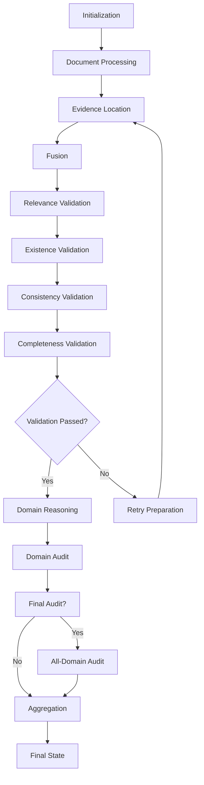

# State Management

<cite>
**Referenced Files in This Document**   
- [rob2_graph.py](file://src/pipelines/graphs/rob2_graph.py)
- [domain_audit.py](file://src/pipelines/graphs/nodes/domain_audit.py)
- [completeness.py](file://src/pipelines/graphs/nodes/validators/completeness.py)
- [existence.py](file://src/pipelines/graphs/nodes/validators/existence.py)
- [consistency.py](file://src/pipelines/graphs/nodes/validators/consistency.py)
- [routing.py](file://src/pipelines/graphs/routing.py)
</cite>

## Table of Contents
1. [Introduction](#introduction)
2. [Rob2GraphState Structure](#rob2graphstate-structure)
3. [Document Processing Fields](#document-processing-fields)
4. [Retrieval Configuration](#retrieval-configuration)
5. [Validation Parameters](#validation-parameters)
6. [Domain Reasoning Models](#domain-reasoning-models)
7. [Audit Settings](#audit-settings)
8. [Workflow Tracking](#workflow-tracking)
9. [State Initialization and Mutation](#state-initialization-and-mutation)
10. [Annotated Types for List Accumulation](#annotated-types-for-list-accumulation)
11. [State Evolution Through Workflow Lifecycle](#state-evolution-through-workflow-lifecycle)
12. [Best Practices for State Access and Modification](#best-practices-for-state-access-and-modification)

## Introduction
The Rob2GraphState is a central TypedDict that serves as the state container for the LangGraph workflow in the ROB2 assessment system. This comprehensive state management structure coordinates the entire workflow from document preprocessing through evidence retrieval, validation, domain reasoning, and final aggregation. The state container is designed to maintain all necessary configuration parameters, intermediate results, and tracking information throughout the multi-stage workflow. It enables seamless data flow between nodes while supporting complex operations such as validation retries and evidence patching. The state evolves dynamically as the workflow progresses, with specific fields being initialized, updated, and accumulated at different stages of processing.

## Rob2GraphState Structure
The Rob2GraphState is implemented as a TypedDict with optional fields, allowing for flexible state management throughout the workflow lifecycle. The structure is organized into functional areas that correspond to different stages of the ROB2 assessment process. Key structural characteristics include configuration parameters for various components (retrieval, validation, reasoning), intermediate data structures for evidence processing, and tracking fields for workflow control. The state container supports both simple scalar values and complex nested structures, including dictionaries and lists. Notably, certain fields use Annotated types with operator.add to enable list accumulation across workflow iterations, which is critical for maintaining audit trails and retry logs. The TypedDict implementation provides type safety while allowing for the dynamic nature required by the workflow system.

**Section sources**
- [rob2_graph.py](file://src/pipelines/graphs/rob2_graph.py#L46-L205)

## Document Processing Fields
The document processing fields in Rob2GraphState manage the core document information and processing parameters. The `pdf_path` field stores the file path to the input PDF document, serving as the primary input for the workflow. The `doc_structure` field contains the parsed document structure as a dictionary, representing the hierarchical organization of the document's content. Additional processing parameters include `docling_layout_model` for layout analysis, `docling_artifacts_path` for temporary file storage, and `docling_chunker_model` for document chunking configuration. The `docling_chunker_max_tokens` parameter controls the maximum number of tokens per document chunk, influencing how the document is segmented for processing. These fields collectively provide the foundation for all subsequent analysis by ensuring the document is properly parsed and structured for evidence retrieval and validation.

**Section sources**
- [rob2_graph.py](file://src/pipelines/graphs/rob2_graph.py#L47-L54)

## Retrieval Configuration
The retrieval configuration fields control the evidence location process through multiple retrieval engines. The `top_k` parameter determines the number of top evidence candidates to retain from each retrieval method, while `per_query_top_n` specifies how many candidates to consider per query before final ranking. The `rrf_k` parameter is used in the Reciprocal Rank Fusion algorithm for combining results from different retrieval engines. The `query_planner` field specifies whether to use deterministic or LLM-based query planning, with corresponding configuration parameters including `query_planner_model`, `query_planner_temperature`, and `query_planner_max_tokens`. Retrieval-specific settings include `reranker` type (none or cross_encoder), `splade_model_id` for sparse retrieval, and various performance parameters like `splade_batch_size` and `splade_query_max_length`. The `use_structure` boolean enables or disables structure-aware retrieval, and `section_bonus_weight` controls the bonus applied to evidence from relevant document sections.

**Section sources**
- [rob2_graph.py](file://src/pipelines/graphs/rob2_graph.py#L55-L80)

## Validation Parameters
The validation parameters govern the multi-stage validation process that ensures evidence quality and completeness. The `relevance_mode` field controls whether relevance validation uses LLM-based assessment or is disabled. Related relevance configuration includes `relevance_min_confidence`, `relevance_require_quote`, and `relevance_top_k`. The `existence_require_text_match` and `existence_require_quote_in_source` fields enforce strict matching requirements for existence validation. The `consistency_mode` parameter determines whether consistency validation is performed using LLM analysis, with associated settings like `consistency_min_confidence` and `consistency_top_n`. The `completeness_enforce` flag enables strict completeness checking, while `completeness_require_relevance` determines whether relevance is required for completeness validation. These parameters collectively define the validation rigor and can be adjusted based on workflow requirements and retry scenarios.

**Section sources**
- [rob2_graph.py](file://src/pipelines/graphs/rob2_graph.py#L85-L119)

## Domain Reasoning Models
The domain reasoning model fields configure the LLM-based decision-making process for each ROB2 domain (D1-D5). Each domain has its own set of configuration parameters including `d1_model`, `d2_model`, `d3_model`, `d4_model`, and `d5_model` to specify the model ID, along with corresponding `d1_model_provider`, `d2_model_provider`, etc., to identify the model provider. Temperature settings (`d1_temperature`, `d2_temperature`, etc.) control the randomness of the LLM output, while timeout and token limits (`d1_timeout`, `d1_max_tokens`, etc.) manage performance and cost. Retry configurations (`d1_max_retries`, `d2_max_retries`, etc.) ensure robustness in case of model failures. The `d2_effect_type` parameter specifically configures D2 reasoning for either "assignment" or "adherence" effect types. These model configurations allow for domain-specific tuning of the reasoning process while maintaining a consistent interface across domains.

**Section sources**
- [rob2_graph.py](file://src/pipelines/graphs/rob2_graph.py#L101-L158)

## Audit Settings
The audit settings configure the full-text audit process that verifies and potentially corrects domain decisions. The `domain_audit_mode` field controls whether audit is enabled (llm) or disabled (none). When enabled, `domain_audit_model` and `domain_audit_model_provider` specify the LLM to use for auditing, with standard LLM parameters including `domain_audit_temperature`, `domain_audit_timeout`, and `domain_audit_max_tokens`. The `domain_audit_patch_window` parameter determines how many adjacent paragraphs to include when patching evidence, while `domain_audit_max_patches_per_question` limits the number of patches applied per question. The `domain_audit_rerun_domains` flag controls whether domains should be re-executed after evidence patching. The `domain_audit_final` boolean enables or disables the final all-domain audit step. These settings provide comprehensive control over the audit process, balancing thoroughness with computational efficiency.

**Section sources**
- [rob2_graph.py](file://src/pipelines/graphs/rob2_graph.py#L160-L171)
- [domain_audit.py](file://src/pipelines/graphs/nodes/domain_audit.py#L329-L393)

## Workflow Tracking
The workflow tracking fields monitor the progress and status of the workflow execution. The `validation_attempt` counter tracks the current validation attempt number, starting from 0. The `validation_max_retries` parameter sets the maximum number of validation retries allowed. The `validation_fail_on_consistency` flag determines whether consistency failures should cause validation to fail, while `validation_relax_on_retry` controls whether validation criteria are relaxed on retry. The `completeness_passed` boolean indicates whether completeness validation passed, with `completeness_failed_questions` listing any questions that failed. Similarly, `consistency_failed_questions` tracks questions with consistency issues. The `rob2_result` field stores the final assessment result, and `rob2_table_markdown` contains the formatted results table. These tracking fields enable conditional routing and provide visibility into the workflow status.

**Section sources**
- [rob2_graph.py](file://src/pipelines/graphs/rob2_graph.py#L206-L209)
- [rob2_graph.py](file://src/pipelines/graphs/rob2_graph.py#L197-L199)

## State Initialization and Mutation
State initialization begins with the `_init_validation_state_node` function, which sets default values for validation-related fields when they are not explicitly provided. This initialization ensures consistent starting conditions for the validation process. The state is mutated through a series of node functions that update specific fields based on their processing results. For example, the `completeness_validator_node` updates `validated_candidates`, `validated_evidence`, and `completeness_passed` based on the completeness assessment. The `existence_validator_node` modifies `existence_candidates` and `existence_evidence` after performing existence checks. The `consistency_validator_node` updates `consistency_reports` and `consistency_failed_questions` following consistency analysis. During validation retries, the `_prepare_validation_retry_node` function increases retrieval parameters and potentially relaxes validation criteria by updating `per_query_top_n`, `top_k`, and validation requirements. These mutation patterns follow a consistent approach where each node returns a dictionary of updates that are merged into the state.

**Section sources**
- [rob2_graph.py](file://src/pipelines/graphs/rob2_graph.py#L216-L245)
- [completeness.py](file://src/pipelines/graphs/nodes/validators/completeness.py#L20-L140)
- [existence.py](file://src/pipelines/graphs/nodes/validators/existence.py#L13-L107)
- [consistency.py](file://src/pipelines/graphs/nodes/validators/consistency.py#L17-L159)
- [rob2_graph.py](file://src/pipelines/graphs/rob2_graph.py#L248-L285)

## Annotated Types for List Accumulation
The Rob2GraphState employs Annotated types with operator.add to enable list accumulation across workflow iterations. The `domain_audit_reports` field is defined as `Annotated[list[dict], operator.add]`, allowing audit reports from multiple audit nodes to be accumulated into a single list. Similarly, `validation_retry_log` uses the same annotation to accumulate retry information from multiple validation attempts. This accumulation pattern is essential for maintaining complete audit trails and retry histories without losing information from previous iterations. When a node returns a list for these fields, LangGraph automatically concatenates it with the existing list rather than overwriting it. This behavior is particularly important for the audit process, where reports from individual domain audits (D1-D5) need to be collected and preserved, as well as for the retry mechanism, where each retry attempt's details must be recorded for analysis and debugging.

**Section sources**
- [rob2_graph.py](file://src/pipelines/graphs/rob2_graph.py#L173-L174)
- [rob2_graph.py](file://src/pipelines/graphs/rob2_graph.py#L210-L211)

## State Evolution Through Workflow Lifecycle
The state evolves systematically through the workflow lifecycle, following a defined progression from initialization to final aggregation. Initially, document processing fields are populated during the preprocessing stage. In the evidence location phase, retrieval configuration parameters guide the retrieval process, populating candidate fields like `rule_based_candidates`, `bm25_candidates`, and `splade_candidates`. The fusion stage combines these into `fusion_candidates`, which then flow into the validation pipeline. During validation, the state is progressively enriched with validation results: `relevance_candidates` after relevance checking, `existence_candidates` after existence validation, and finally `validated_candidates` after completeness assessment. If validation fails, the state enters a retry loop where parameters are adjusted and evidence location is repeated. After successful validation, domain reasoning nodes populate decision fields (`d1_decision`, `d2_decision`, etc.), followed by audit nodes that may patch evidence and trigger domain re-execution. The final state contains all intermediate results and the aggregated output.

**Diagram sources**
- [rob2_graph.py](file://src/pipelines/graphs/rob2_graph.py#L288-L425)
- [routing.py](file://src/pipelines/graphs/routing.py#L28-L57)

## Best Practices for State Access and Modification
When accessing and modifying state within nodes, several best practices should be followed. Always validate the presence of required fields before use, raising descriptive errors for missing data. When reading configuration parameters, provide sensible defaults using the `get()` method with appropriate fallback values. For state modification, return only the fields that need to be updated rather than the entire state to minimize memory usage and potential conflicts. When working with nested structures, create copies of dictionaries and lists before modification to avoid unintended side effects. For list accumulation fields like `domain_audit_reports` and `validation_retry_log`, return a list containing only the new items to be appended. When updating multiple related fields, ensure consistency between them (e.g., updating both `validated_candidates` and `validated_evidence` together). Finally, include comprehensive configuration information in output dictionaries to enable debugging and auditing of the decision-making process.

**Section sources**
- [completeness.py](file://src/pipelines/graphs/nodes/validators/completeness.py#L20-L140)
- [existence.py](file://src/pipelines/graphs/nodes/validators/existence.py#L13-L107)
- [consistency.py](file://src/pipelines/graphs/nodes/validators/consistency.py#L17-L159)
- [domain_audit.py](file://src/pipelines/graphs/nodes/domain_audit.py#L98-L243)