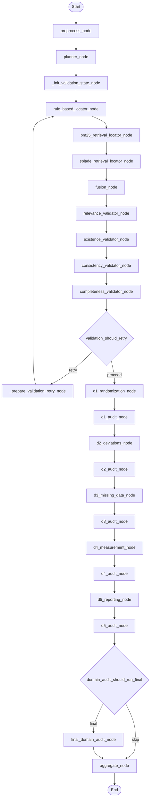
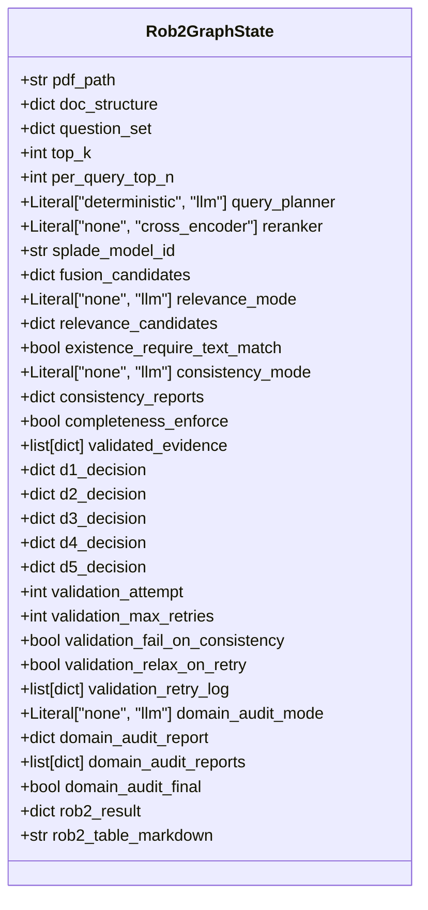
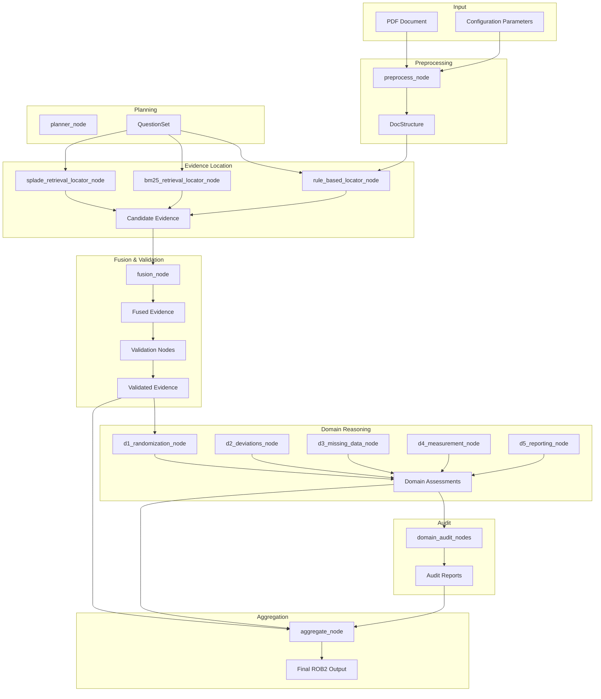
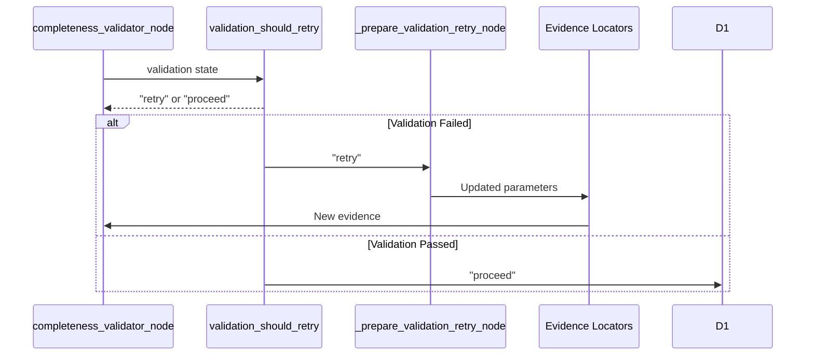
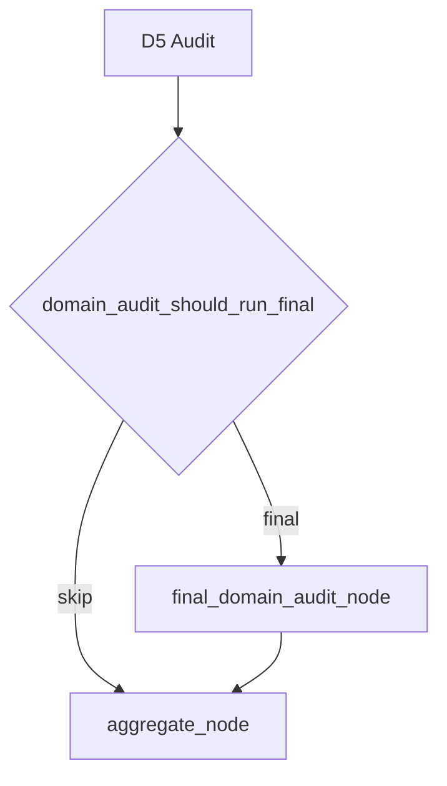

# Workflow Architecture

<cite>
**Referenced Files in This Document**   
- [rob2_graph.py](file://src/pipelines/graphs/rob2_graph.py)
- [system-uml.md](file://docs/system-uml.md)
- [Rob2GraphState](file://src/pipelines/graphs/rob2_graph.py#L46-L212)
- [routing.py](file://src/pipelines/graphs/routing.py)
- [preprocess.py](file://src/pipelines/graphs/nodes/preprocess.py)
- [planner.py](file://src/pipelines/graphs/nodes/planner.py)
- [fusion.py](file://src/pipelines/graphs/nodes/fusion.py)
- [completeness.py](file://src/pipelines/graphs/nodes/validators/completeness.py)
- [d1_randomization.py](file://src/pipelines/graphs/nodes/domains/d1_randomization.py)
- [domain_audit.py](file://src/pipelines/graphs/nodes/domain_audit.py)
- [decision_rules.py](file://src/rob2/decision_rules.py)
- [aggregate.py](file://src/pipelines/graphs/nodes/aggregate.py)
</cite>

## Table of Contents
1. [Introduction](#introduction)
2. [StateGraph Design](#stateggraph-design)
3. [Workflow Sequence](#workflow-sequence)
4. [State Management](#state-management)
5. [Data Flow and Component Interactions](#data-flow-and-component-interactions)
6. [Critical Architectural Decisions](#critical-architectural-decisions)
7. [Scalability and Performance](#scalability-and-performance)
8. [Infrastructure and Deployment](#infrastructure-and-deployment)

## Introduction
The LangGraph workflow engine implements a sophisticated evidence-based assessment system for ROB2 (Risk of Bias 2) analysis in clinical trials. This document provides comprehensive architectural documentation for the StateGraph implementation in rob2_graph.py, detailing the high-level design, workflow orchestration, state management, and critical architectural decisions. The system processes scientific documents through a multi-stage pipeline that includes document preprocessing, question planning, evidence location, fusion, validation, domain reasoning, and result aggregation. The architecture leverages LangGraph's stateful workflow capabilities to manage complex conditional logic, retry mechanisms, and data flow across over 200 state fields that track workflow progress.

## StateGraph Design

The StateGraph in rob2_graph.py implements a directed acyclic graph (DAG) with conditional routing that orchestrates the complete ROB2 assessment workflow. The graph is built using LangGraph's StateGraph class, which allows for stateful workflow execution with persistent state management between nodes.

**Diagram sources**
- [rob2_graph.py](file://src/pipelines/graphs/rob2_graph.py#L288-L422)

**Section sources**
- [rob2_graph.py](file://src/pipelines/graphs/rob2_graph.py#L288-L422)

## Workflow Sequence

The workflow sequence follows a structured progression from document preprocessing through final result aggregation, with well-defined milestones for each phase of the ROB2 assessment.

### Document Preprocessing
The workflow begins with document preprocessing, where the input PDF is parsed into a structured document representation using Docling. The preprocess_node extracts text content, section hierarchy, and metadata from the PDF, creating a normalized document structure that serves as the foundation for subsequent evidence location.

**Section sources**
- [preprocess.py](file://src/pipelines/graphs/nodes/preprocess.py#L28-L36)

### Question Planning
Following preprocessing, the planner_node retrieves the standardized ROB2 question set from the question bank. This node loads the complete set of signaling questions organized by domain (D1-D5), establishing the framework for the evidence-based assessment.

**Section sources**
- [planner.py](file://src/pipelines/graphs/nodes/planner.py#L8-L11)

### Evidence Location
The evidence location phase employs a multi-engine approach to identify relevant evidence for each question. Three distinct locator strategies are executed sequentially:

1. **Rule-based locator**: Applies domain-specific rules to identify evidence based on document structure and content patterns
2. **BM25 retrieval**: Uses traditional information retrieval techniques to find relevant text passages
3. **SPLADE retrieval**: Leverages sparse lexical matching with learned representations for enhanced retrieval

Each locator produces candidate evidence that is later fused and validated.

**Section sources**
- [rob2_graph.py](file://src/pipelines/graphs/rob2_graph.py#L299-L310)

### Evidence Fusion
The fusion_node combines candidates from multiple locator engines into a single ranked list per question ID. This fusion process uses Reciprocal Rank Fusion (RRF) with configurable engine weights to merge results from rule-based, BM25, and SPLADE retrieval systems. The fused evidence is organized into top-k bundles for subsequent validation.

**Section sources**
- [fusion.py](file://src/pipelines/graphs/nodes/fusion.py#L16-L83)

### Validation
The validation phase consists of a multi-stage filtering process that ensures evidence quality and completeness:

1. **Relevance validation**: Uses LLM-based assessment to determine if evidence is relevant to the question
2. **Existence validation**: Verifies that cited evidence actually exists in the document structure
3. **Consistency validation**: Checks for contradictions across multiple evidence pieces for the same question
4. **Completeness validation**: Ensures sufficient evidence has been gathered to make a reliable assessment

**Section sources**
- [rob2_graph.py](file://src/pipelines/graphs/rob2_graph.py#L313-L330)

### Domain Reasoning
After validation, the workflow proceeds to domain-specific reasoning for each of the five ROB2 domains (D1-D5). Each domain node (d1_randomization_node, d2_deviations_node, etc.) uses LLM-based reasoning to analyze the validated evidence and generate domain-specific risk assessments. The reasoning process follows standardized decision rules defined in decision_rules.py.

**Section sources**
- [d1_randomization.py](file://src/pipelines/graphs/nodes/domains/d1_randomization.py#L15-L44)
- [decision_rules.py](file://src/rob2/decision_rules.py#L22-L194)

### Result Aggregation
The final aggregation phase combines domain assessments into a comprehensive ROB2 report. The aggregate_node formats the results into both structured JSON output and human-readable Markdown tables, including citations and rationale for each assessment.

**Section sources**
- [aggregate.py](file://src/pipelines/graphs/nodes/aggregate.py#L32-L109)

## State Management

The workflow employs a comprehensive state management system through the Rob2GraphState class, which contains over 200 fields tracking workflow progress, configuration parameters, and intermediate results.

**Diagram sources**
- [rob2_graph.py](file://src/pipelines/graphs/rob2_graph.py#L46-L212)

The state object serves as the central data repository throughout the workflow, with each node reading from and writing to specific fields. The state includes:

- **Document and configuration parameters**: PDF path, model configurations, retrieval parameters
- **Evidence tracking**: Candidates from each locator, fused evidence, validated evidence
- **Validation state**: Attempt counters, retry configuration, validation results
- **Domain assessment results**: Decision outputs for each domain
- **Audit and reporting data**: Audit reports, final results in multiple formats

This comprehensive state management enables the workflow to maintain context across nodes and support complex features like retry mechanisms and audit trails.

**Section sources**
- [rob2_graph.py](file://src/pipelines/graphs/rob2_graph.py#L46-L212)

## Data Flow and Component Interactions

The system context diagram illustrates the data flow and component interactions within the LangGraph workflow engine.

**Diagram sources**
- [system-uml.md](file://docs/system-uml.md#L4-L102)

The data flow follows a sequential but stateful progression, with each component building upon the outputs of previous stages. The workflow maintains data integrity through typed schemas defined in the schemas/internal directory, ensuring consistent data structures throughout the pipeline.

**Section sources**
- [system-uml.md](file://docs/system-uml.md#L4-L102)

## Critical Architectural Decisions

### Retry Mechanism for Validation Failures
The system implements a sophisticated retry mechanism that automatically rolls back to the evidence location phase when validation fails. This is achieved through conditional edges in the StateGraph that route based on the validation_should_retry function.

**Diagram sources**
- [rob2_graph.py](file://src/pipelines/graphs/rob2_graph.py#L395-L399)
- [routing.py](file://src/pipelines/graphs/routing.py#L28-L43)

The retry mechanism dynamically adjusts retrieval parameters to improve evidence quality on subsequent attempts, including disabling structure-aware filtering, increasing the number of candidates, and relaxing validation requirements.

**Section sources**
- [rob2_graph.py](file://src/pipelines/graphs/rob2_graph.py#L248-L285)
- [routing.py](file://src/pipelines/graphs/routing.py#L28-L43)

### Conditional Execution of Audit Steps
The architecture supports conditional execution of audit steps through the domain_audit_should_run_final routing function. This allows the final domain audit to be enabled or disabled based on configuration, providing flexibility in the assessment process.

**Diagram sources**
- [rob2_graph.py](file://src/pipelines/graphs/rob2_graph.py#L410-L414)
- [routing.py](file://src/pipelines/graphs/routing.py#L46-L54)

The audit nodes implement a "patch and re-run" pattern where they can modify the validated evidence and immediately re-execute the corresponding domain reasoning, ensuring that audit findings are incorporated into the final assessment.

**Section sources**
- [domain_audit.py](file://src/pipelines/graphs/nodes/domain_audit.py#L119-L243)

## Scalability and Performance

The architecture incorporates several performance optimization strategies to handle the computational demands of evidence-based assessment:

1. **Caching**: The preprocess_node implements caching for Docling converters and chunkers to avoid redundant initialization
2. **Parallelizable design**: The modular node structure allows for potential parallel execution of independent components
3. **Configurable resource usage**: Parameters for model loading, batch sizes, and timeouts can be tuned based on available resources
4. **Incremental processing**: The stateful workflow enables resumption from specific points, reducing redundant computation

The system also addresses scalability through configuration options that balance thoroughness with performance, such as adjustable top-k values, retrieval limits, and validation strictness levels.

**Section sources**
- [preprocess.py](file://src/pipelines/graphs/nodes/preprocess.py#L24-L25)
- [rob2_runner.py](file://src/services/rob2_runner.py#L20-L39)

## Infrastructure and Deployment

The system is designed for flexible deployment with the following infrastructure requirements:

- **Python environment**: Python 3.9+ with dependencies specified in pyproject.toml
- **Model storage**: Local or remote access to LLM models and embedding models
- **Document processing**: Access to Docling for PDF parsing and structure extraction
- **Retrieval systems**: Support for BM25 and SPLADE retrieval engines
- **Hardware**: Sufficient memory for model loading and document processing, with GPU acceleration recommended for LLM operations

Deployment topology recommendations include:

1. **Standalone execution**: Direct execution via CLI for individual document assessment
2. **API service**: Containerized deployment with REST API interface for integration with other systems
3. **Batch processing**: Scheduled execution for processing multiple documents
4. **Cloud deployment**: Scalable deployment on cloud platforms with auto-scaling capabilities

The modular architecture supports various deployment patterns while maintaining consistent behavior across environments.

**Section sources**
- [rob2_runner.py](file://src/services/rob2_runner.py#L41-L65)
- [graph.py](file://src/cli/commands/graph.py#L69-L117)