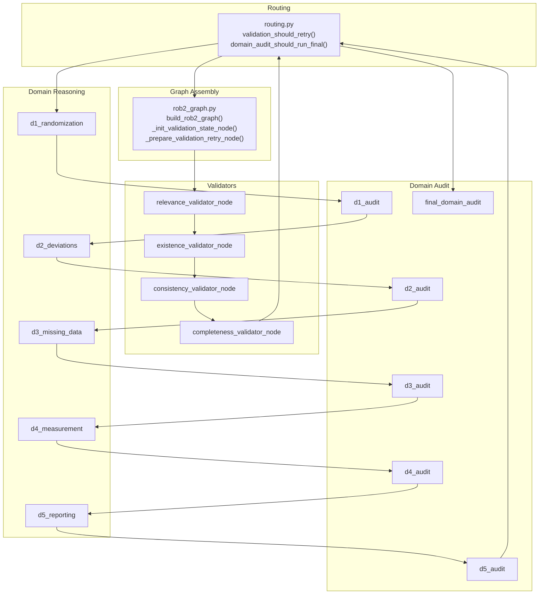
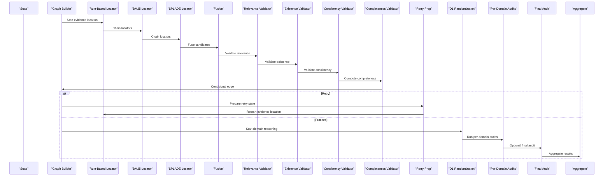
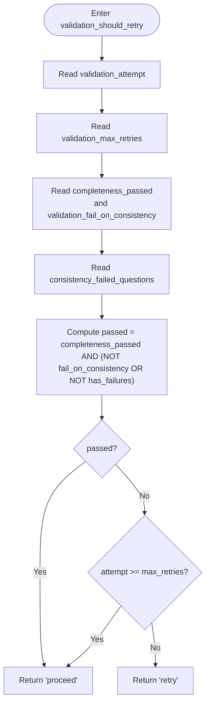
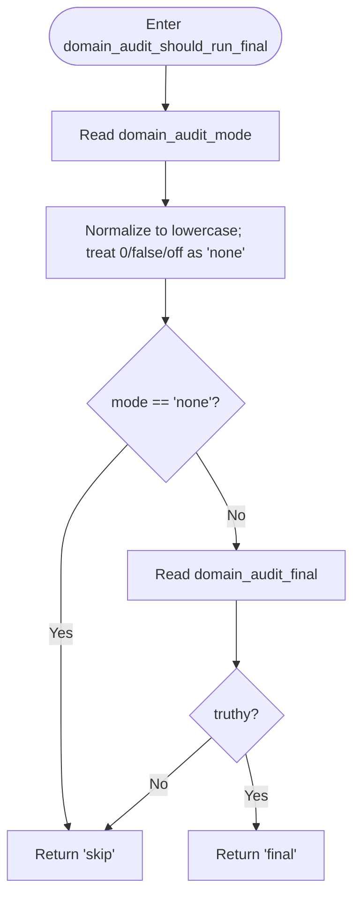
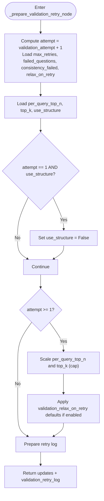
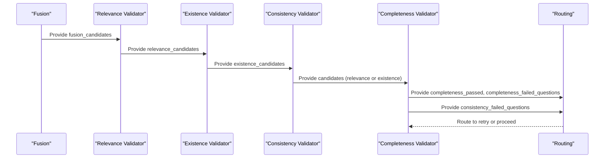
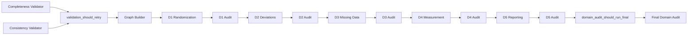

# Conditional Routing

<cite>
**Referenced Files in This Document**
- [routing.py](file://src/pipelines/graphs/routing.py)
- [rob2_graph.py](file://src/pipelines/graphs/rob2_graph.py)
- [completeness.py](file://src/pipelines/graphs/nodes/validators/completeness.py)
- [consistency.py](file://src/pipelines/graphs/nodes/validators/consistency.py)
- [domain_audit.py](file://src/pipelines/graphs/nodes/domain_audit.py)
- [test_validation_routing.py](file://tests/unit/test_validation_routing.py)
- [test_rob2_workflow_retry.py](file://tests/integration/test_rob2_workflow_retry.py)
- [0003-validation-mode-and-completeness-relaxation.md](file://docs/adr/0003-validation-mode-and-completeness-relaxation.md)
</cite>

## Table of Contents
1. [Introduction](#introduction)
2. [Project Structure](#project-structure)
3. [Core Components](#core-components)
4. [Architecture Overview](#architecture-overview)
5. [Detailed Component Analysis](#detailed-component-analysis)
6. [Dependency Analysis](#dependency-analysis)
7. [Performance Considerations](#performance-considerations)
8. [Troubleshooting Guide](#troubleshooting-guide)
9. [Conclusion](#conclusion)
10. [Appendices](#appendices)

## Introduction
This document explains the conditional routing system in the ROB2 workflow, focusing on:
- How validation_should_retry decides whether to retry evidence location or proceed to domain reasoning.
- How domain_audit_should_run_final controls execution of the final_domain_audit node.
- How the retry mechanism modifies state in _prepare_validation_retry_node, including parameter relaxation (disabling structure awareness, increasing top-k values) on subsequent attempts.
- Practical examples of how these routing decisions affect workflow behavior and output quality.
- Troubleshooting guidance and testing strategies for conditional logic.

## Project Structure
The routing logic is implemented in a dedicated module and wired into the ROB2 graph. The validators produce outputs that feed into routing decisions, while the domain audit nodes optionally run after domain reasoning.

**Diagram sources**
- [routing.py](file://src/pipelines/graphs/routing.py#L28-L57)
- [rob2_graph.py](file://src/pipelines/graphs/rob2_graph.py#L288-L423)
- [completeness.py](file://src/pipelines/graphs/nodes/validators/completeness.py#L20-L126)
- [consistency.py](file://src/pipelines/graphs/nodes/validators/consistency.py#L17-L144)
- [domain_audit.py](file://src/pipelines/graphs/nodes/domain_audit.py#L98-L122)

**Section sources**
- [routing.py](file://src/pipelines/graphs/routing.py#L1-L57)
- [rob2_graph.py](file://src/pipelines/graphs/rob2_graph.py#L288-L423)

## Core Components
- validation_should_retry: Evaluates validation_attempt, validation_max_retries, completeness_passed, and consistency_failed_questions to route to retry or proceed.
- domain_audit_should_run_final: Controls whether to run final_domain_audit after D5 reasoning.
- _prepare_validation_retry_node: Prepares state for a retry attempt, including parameter relaxation and logging.
- Validators: Relevance, existence, consistency, and completeness produce outputs consumed by routing.

**Section sources**
- [routing.py](file://src/pipelines/graphs/routing.py#L28-L57)
- [rob2_graph.py](file://src/pipelines/graphs/rob2_graph.py#L216-L285)
- [completeness.py](file://src/pipelines/graphs/nodes/validators/completeness.py#L20-L126)
- [consistency.py](file://src/pipelines/graphs/nodes/validators/consistency.py#L17-L144)
- [domain_audit.py](file://src/pipelines/graphs/nodes/domain_audit.py#L98-L122)

## Architecture Overview
The ROB2 graph orchestrates evidence location, validation, domain reasoning, and optional domain audit. Conditional edges route based on state computed by validators and routing helpers.

**Diagram sources**
- [rob2_graph.py](file://src/pipelines/graphs/rob2_graph.py#L288-L423)
- [routing.py](file://src/pipelines/graphs/routing.py#L28-L57)
- [completeness.py](file://src/pipelines/graphs/nodes/validators/completeness.py#L20-L126)
- [consistency.py](file://src/pipelines/graphs/nodes/validators/consistency.py#L17-L144)
- [domain_audit.py](file://src/pipelines/graphs/nodes/domain_audit.py#L98-L122)

## Detailed Component Analysis

### validation_should_retry
Purpose: After Milestone 7 validation, decide whether to retry evidence location or proceed to domain reasoning.

Decision logic:
- Passed if completeness_passed is true AND either validation_fail_on_consistency is false OR there are no consistency failures.
- Otherwise, retry if validation_attempt < validation_max_retries; otherwise proceed.

Behavioral implications:
- Prevents infinite loops by honoring validation_max_retries.
- Allows disabling consistency failures as a gating factor via validation_fail_on_consistency.
- Enables robustness by rolling back to evidence location when completeness or consistency fails.

**Diagram sources**
- [routing.py](file://src/pipelines/graphs/routing.py#L28-L44)

**Section sources**
- [routing.py](file://src/pipelines/graphs/routing.py#L28-L44)
- [test_validation_routing.py](file://tests/unit/test_validation_routing.py#L6-L78)

### domain_audit_should_run_final
Purpose: Control execution of final_domain_audit after D5 reasoning.

Decision logic:
- If domain_audit_mode is "none" (or falsy), skip.
- Else, if domain_audit_final is truthy, run final; otherwise skip.

Behavioral implications:
- Switchable final audit ensures optional post-hoc verification across all domains.
- Mode normalization allows flexible configuration strings.

**Diagram sources**
- [routing.py](file://src/pipelines/graphs/routing.py#L46-L55)
- [domain_audit.py](file://src/pipelines/graphs/nodes/domain_audit.py#L119-L122)

**Section sources**
- [routing.py](file://src/pipelines/graphs/routing.py#L46-L55)
- [domain_audit.py](file://src/pipelines/graphs/nodes/domain_audit.py#L119-L122)

### _prepare_validation_retry_node
Purpose: Modify state for a retry attempt, including parameter relaxation and logging.

Key modifications:
- Increment validation_attempt.
- On first retry (attempt == 1) and when structure-aware retrieval is enabled, disable structure awareness.
- Increase per_query_top_n and top_k (capped) and propagate to fusion_top_k.
- Optionally relax validation parameters when validation_relax_on_retry is true:
  - completeness_require_relevance = False
  - relevance_min_confidence = relaxed default
  - relevance_require_quote = False
  - existence_require_text_match = False
  - existence_require_quote_in_source = False
- Append a retry log entry with attempt, max_retries, failed questions, and applied updates.

Impact on workflow:
- Increases recall during retries to mitigate missing relevant evidence.
- Temporarily relaxes strictness to recover from false negatives.
- Preserves deterministic behavior by capping growth and defaults.

**Diagram sources**
- [rob2_graph.py](file://src/pipelines/graphs/rob2_graph.py#L248-L285)

**Section sources**
- [rob2_graph.py](file://src/pipelines/graphs/rob2_graph.py#L248-L285)
- [0003-validation-mode-and-completeness-relaxation.md](file://docs/adr/0003-validation-mode-and-completeness-relaxation.md#L1-L36)

### Validators and Their Role in Routing
- Relevance Validator: Produces relevance_candidates and evidence bundles; influences downstream existence and completeness.
- Existence Validator: Produces existence_candidates; filters candidates by textual presence.
- Consistency Validator: Produces consistency_failed_questions; informs routing via validation_should_retry.
- Completeness Validator: Produces completeness_passed, completeness_failed_questions, and validated_evidence; triggers routing decisions.

**Diagram sources**
- [completeness.py](file://src/pipelines/graphs/nodes/validators/completeness.py#L20-L126)
- [consistency.py](file://src/pipelines/graphs/nodes/validators/consistency.py#L17-L144)
- [routing.py](file://src/pipelines/graphs/routing.py#L28-L44)

**Section sources**
- [completeness.py](file://src/pipelines/graphs/nodes/validators/completeness.py#L20-L126)
- [consistency.py](file://src/pipelines/graphs/nodes/validators/consistency.py#L17-L144)

## Dependency Analysis
- Routing depends on state keys set by validators and initialization nodes.
- Graph wiring connects validators to routing and domain reasoning nodes.
- Domain audit nodes depend on state keys set by earlier nodes and can optionally rerun a domain agent after patching.

**Diagram sources**
- [rob2_graph.py](file://src/pipelines/graphs/rob2_graph.py#L288-L423)
- [routing.py](file://src/pipelines/graphs/routing.py#L28-L57)
- [domain_audit.py](file://src/pipelines/graphs/nodes/domain_audit.py#L98-L122)

**Section sources**
- [rob2_graph.py](file://src/pipelines/graphs/rob2_graph.py#L288-L423)
- [routing.py](file://src/pipelines/graphs/routing.py#L28-L57)
- [domain_audit.py](file://src/pipelines/graphs/nodes/domain_audit.py#L98-L122)

## Performance Considerations
- Retry scaling increases per_query_top_n and top_k; cap values prevent unbounded resource usage.
- Disabling structure awareness reduces computational overhead on later attempts.
- The graph sets a higher recursion limit to accommodate potential retry loops.

Practical tips:
- Tune validation_max_retries to balance quality and latency.
- Monitor validation_retry_log to assess effectiveness of relaxations.
- Consider domain_audit_mode and domain_audit_final to control extra LLM calls.

**Section sources**
- [rob2_graph.py](file://src/pipelines/graphs/rob2_graph.py#L418-L423)
- [rob2_graph.py](file://src/pipelines/graphs/rob2_graph.py#L248-L285)

## Troubleshooting Guide
Common issues and resolutions:
- Routing stuck in retry loop:
  - Verify validation_max_retries is sufficient but finite.
  - Confirm completeness_passed and consistency_failed_questions reflect actual validation outcomes.
  - Check validation_fail_on_consistency to ensure it aligns with expectations.
- Unexpected proceed despite failures:
  - Review validation_should_retry logic and state flags.
  - Ensure consistency_failed_questions is populated when failures occur.
- Relaxed parameters not taking effect:
  - Confirm validation_relax_on_retry is enabled.
  - Inspect validation_retry_log for applied updates.
- Final audit not running:
  - Ensure domain_audit_mode is not "none".
  - Confirm domain_audit_final is truthy.

Testing strategies:
- Unit tests validate routing under various combinations of flags and failure lists.
- Integration tests simulate a failing consistency validator and confirm recovery via retry and evidence location restart.

**Section sources**
- [test_validation_routing.py](file://tests/unit/test_validation_routing.py#L6-L78)
- [test_rob2_workflow_retry.py](file://tests/integration/test_rob2_workflow_retry.py#L120-L278)

## Conclusion
The conditional routing system in ROB2 provides robust retry semantics for Milestone 7 validation and optional final domain audit. By evaluating completeness and consistency outcomes, and by carefully relaxing validation parameters on retries, the workflow improves resilience while preserving quality defaults. The design separates configuration from outputs and logs retry actions, enabling observability and controlled behavior.

## Appendices

### Example Scenarios and Expected Behavior
- Completeness passes and no consistency failures:
  - Route proceeds to domain reasoning.
- Completeness fails but budget remains:
  - Route retries evidence location with relaxed parameters.
- Consistency failure with validation_fail_on_consistency enabled:
  - Route retries unless budget exhausted.
- Final audit enabled:
  - After D5 reasoning, run final_domain_audit once across all domains.

These behaviors are validated by unit and integration tests.

**Section sources**
- [test_validation_routing.py](file://tests/unit/test_validation_routing.py#L6-L78)
- [test_rob2_workflow_retry.py](file://tests/integration/test_rob2_workflow_retry.py#L120-L278)