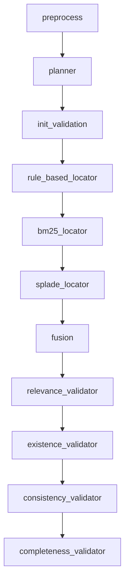
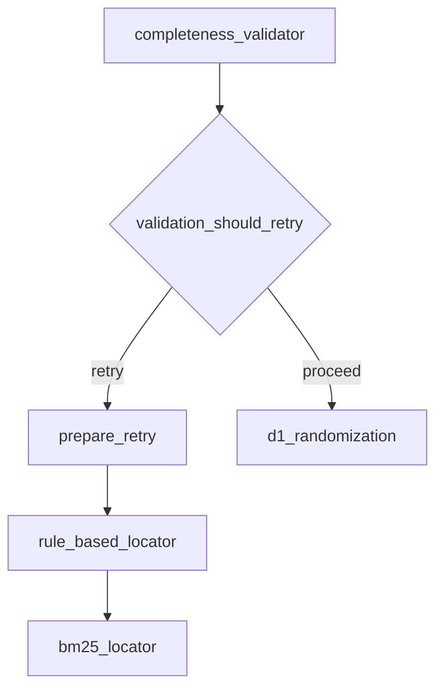
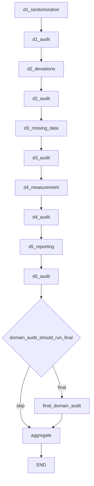

# Node Execution Sequence

<cite>
**Referenced Files in This Document**   
- [rob2_graph.py](file://src/pipelines/graphs/rob2_graph.py)
- [routing.py](file://src/pipelines/graphs/routing.py)
- [preprocess.py](file://src/pipelines/graphs/nodes/preprocess.py)
- [planner.py](file://src/pipelines/graphs/nodes/planner.py)
- [rule_based.py](file://src/pipelines/graphs/nodes/locators/rule_based.py)
- [retrieval_bm25.py](file://src/pipelines/graphs/nodes/locators/retrieval_bm25.py)
- [retrieval_splade.py](file://src/pipelines/graphs/nodes/locators/retrieval_splade.py)
- [fusion.py](file://src/evidence/fusion.py)
- [completeness.py](file://src/pipelines/graphs/nodes/validators/completeness.py)
- [d1_randomization.py](file://src/pipelines/graphs/nodes/domains/d1_randomization.py)
- [d2_deviations.py](file://src/pipelines/graphs/nodes/domains/d2_deviations.py)
- [d3_missing_data.py](file://src/pipelines/graphs/nodes/domains/d3_missing_data.py)
- [d4_measurement.py](file://src/pipelines/graphs/nodes/domains/d4_measurement.py)
- [d5_reporting.py](file://src/pipelines/graphs/nodes/domains/d5_reporting.py)
- [domain_audit.py](file://src/pipelines/graphs/nodes/domain_audit.py)
</cite>

## Table of Contents
1. [Introduction](#introduction)
2. [Linear Execution Sequence](#linear-execution-sequence)
3. [Conditional Routing After Validation](#conditional-routing-after-validation)
4. [Domain Reasoning Flow](#domain-reasoning-flow)
5. [Data Flow with Rob2GraphState](#data-flow-with-rob2graphstate)
6. [Node Registration and Edge Routing](#node-registration-and-edge-routing)
7. [Performance Considerations](#performance-considerations)
8. [Error Handling Patterns](#error-handling-patterns)

## Introduction
This document details the node execution sequence in the LangGraph-based ROB2 workflow. The system processes clinical study PDFs through a series of preprocessing, evidence location, validation, and domain reasoning steps to assess risk of bias. The workflow is implemented as a stateful graph where each node performs a specific function and passes results to subsequent nodes through the shared Rob2GraphState.

**Section sources**
- [rob2_graph.py](file://src/pipelines/graphs/rob2_graph.py#L1-L426)

## Linear Execution Sequence

The node execution follows a linear progression through several key phases:

1. **Preprocessing**: The document is parsed into a structured format using Docling
2. **Planning**: The standardized ROB2 question set is retrieved
3. **Evidence Location**: Three parallel evidence location methods are executed:
   - Rule-based location using section/keyword heuristics
   - BM25 retrieval with multi-query planning and RRF fusion
   - SPLADE retrieval with multi-query planning and RRF fusion
4. **Fusion**: Evidence from all location methods is combined using RRF ranking
5. **Validation**: A series of validators ensure evidence quality:
   - Relevance validation
   - Existence validation  
   - Consistency validation
   - Completeness validation

The linear sequence is implemented through direct edge connections in the StateGraph, ensuring each step completes before the next begins.



**Diagram sources**
- [rob2_graph.py](file://src/pipelines/graphs/rob2_graph.py#L382-L393)

**Section sources**
- [rob2_graph.py](file://src/pipelines/graphs/rob2_graph.py#L293-L330)
- [preprocess.py](file://src/pipelines/graphs/nodes/preprocess.py#L28-L36)
- [planner.py](file://src/pipelines/graphs/nodes/planner.py#L8-L11)
- [rule_based.py](file://src/pipelines/graphs/nodes/locators/rule_based.py#L18-L46)
- [retrieval_bm25.py](file://src/pipelines/graphs/nodes/locators/retrieval_bm25.py#L48-L367)
- [retrieval_splade.py](file://src/pipelines/graphs/nodes/locators/retrieval_splade.py#L49-L443)
- [fusion.py](file://src/evidence/fusion.py#L18-L107)
- [completeness.py](file://src/pipelines/graphs/nodes/validators/completeness.py#L20-L125)

## Conditional Routing After Validation

After completeness validation, the workflow uses conditional routing to determine the next step. The `validation_should_retry` function evaluates whether to proceed to domain reasoning or trigger a retry via `prepare_retry`.

The routing decision is based on:
- Whether completeness validation passed
- Whether consistency validation failed (if configured to fail on consistency)
- The current validation attempt count compared to maximum retries

If validation fails and retries remain, the workflow routes to `prepare_retry`, which adjusts retrieval parameters and returns to the evidence location phase. If validation passes or maximum retries are exhausted, the workflow proceeds to domain reasoning.



**Diagram sources**
- [rob2_graph.py](file://src/pipelines/graphs/rob2_graph.py#L395-L400)
- [routing.py](file://src/pipelines/graphs/routing.py#L28-L43)

**Section sources**
- [rob2_graph.py](file://src/pipelines/graphs/rob2_graph.py#L395-L400)
- [routing.py](file://src/pipelines/graphs/routing.py#L28-L43)
- [rob2_graph.py](file://src/pipelines/graphs/rob2_graph.py#L248-L285)

## Domain Reasoning Flow

The domain reasoning phase follows a sequential flow through the five ROB2 domains (D1-D5), with an audit node after each domain:

1. **D1 Randomization** → D1 Audit
2. **D2 Deviations** → D2 Audit  
3. **D3 Missing Data** → D3 Audit
4. **D4 Measurement** → D4 Audit
5. **D5 Reporting** → D5 Audit

After D5 audit, a final conditional edge determines whether to run a comprehensive `final_domain_audit` based on the `domain_audit_should_run_final` routing function. This function checks the audit mode configuration and whether final audit is explicitly enabled.



**Diagram sources**
- [rob2_graph.py](file://src/pipelines/graphs/rob2_graph.py#L401-L416)
- [routing.py](file://src/pipelines/graphs/routing.py#L46-L54)

**Section sources**
- [rob2_graph.py](file://src/pipelines/graphs/rob2_graph.py#L332-L374)
- [d1_randomization.py](file://src/pipelines/graphs/nodes/domains/d1_randomization.py#L15-L47)
- [d2_deviations.py](file://src/pipelines/graphs/nodes/domains/d2_deviations.py#L16-L57)
- [d3_missing_data.py](file://src/pipelines/graphs/nodes/domains/d3_missing_data.py#L15-L47)
- [d4_measurement.py](file://src/pipelines/graphs/nodes/domains/d4_measurement.py#L15-L47)
- [d5_reporting.py](file://src/pipelines/graphs/nodes/domains/d5_reporting.py#L15-L47)
- [domain_audit.py](file://src/pipelines/graphs/nodes/domain_audit.py)

## Data Flow with Rob2GraphState

The Rob2GraphState serves as the central data structure that flows through all nodes, containing configuration parameters, intermediate results, and final outputs. Key state properties include:

- **Document and configuration**: pdf_path, doc_structure, various model and retrieval parameters
- **Evidence candidates**: rule_based_candidates, bm25_candidates, splade_candidates, fusion_candidates
- **Validation results**: validated_evidence, completeness_report, completeness_passed
- **Domain decisions**: d1_decision, d2_decision, d3_decision, d4_decision, d5_decision
- **Execution tracking**: validation_attempt, validation_retry_log

Each node reads required state properties and writes its results back to the state, enabling the sequential flow of data through the pipeline.

**Section sources**
- [rob2_graph.py](file://src/pipelines/graphs/rob2_graph.py#L46-L214)

## Node Registration and Edge Routing

Nodes are registered in the StateGraph using the `add_node` method, with optional overrides for testing. The graph is constructed in the `build_rob2_graph` function, which registers all nodes and establishes their connections.

Edge routing is implemented through:
- **Direct edges**: Using `add_edge` for linear progression
- **Conditional edges**: Using `add_conditional_edges` with routing functions that return edge keys

The routing functions (`validation_should_retry` and `domain_audit_should_run_final`) are pure functions that examine the current state and return the appropriate edge destination.

```python
# Node registration example
builder.add_node("preprocess", preprocess_node)
builder.add_node("planner", planner_node)

# Direct edge example
builder.add_edge("planner", "init_validation")

# Conditional edge example
builder.add_conditional_edges(
    "completeness_validator",
    validation_should_retry,
    {"retry": "prepare_retry", "proceed": "d1_randomization"},
)
```

**Section sources**
- [rob2_graph.py](file://src/pipelines/graphs/rob2_graph.py#L288-L416)

## Performance Considerations

The linear sequence design has several performance implications:

- **Sequential bottlenecks**: Each node must complete before the next begins, creating potential bottlenecks
- **Retrieval overhead**: BM25 and SPLADE indexing occurs on each retry, which can be expensive
- **Memory usage**: The complete document structure and all evidence candidates are kept in memory
- **LLM costs**: Multiple LLM calls in domain reasoning phases contribute to overall cost

The graph configures a high recursion limit (100) to accommodate the retry loop and deep execution chain, which could impact performance if excessive retries occur.

**Section sources**
- [rob2_graph.py](file://src/pipelines/graphs/rob2_graph.py#L418-L422)
- [retrieval_bm25.py](file://src/pipelines/graphs/nodes/locators/retrieval_bm25.py)
- [retrieval_splade.py](file://src/pipelines/graphs/nodes/locators/retrieval_splade.py)

## Error Handling Patterns

The system employs several error handling patterns:

- **Input validation**: Each node validates required inputs and raises ValueError if missing
- **Fallback mechanisms**: Query planners fall back to deterministic mode if LLM configuration is incomplete
- **Retry with parameter adjustment**: Failed validation triggers parameter adjustments (expanded search, relaxed requirements)
- **Graceful degradation**: Missing optional components (like rerankers) result in fallback behavior rather than failure
- **Comprehensive logging**: Configuration decisions and errors are recorded in state for debugging

The retry mechanism specifically handles evidence quality issues by progressively relaxing constraints and expanding search parameters across attempts.

**Section sources**
- [rob2_graph.py](file://src/pipelines/graphs/rob2_graph.py#L248-L285)
- [retrieval_bm25.py](file://src/pipelines/graphs/nodes/locators/retrieval_bm25.py#L104-L108)
- [retrieval_splade.py](file://src/pipelines/graphs/nodes/locators/retrieval_splade.py#L104-L108)
- [preprocess.py](file://src/pipelines/graphs/nodes/preprocess.py#L89-L91)