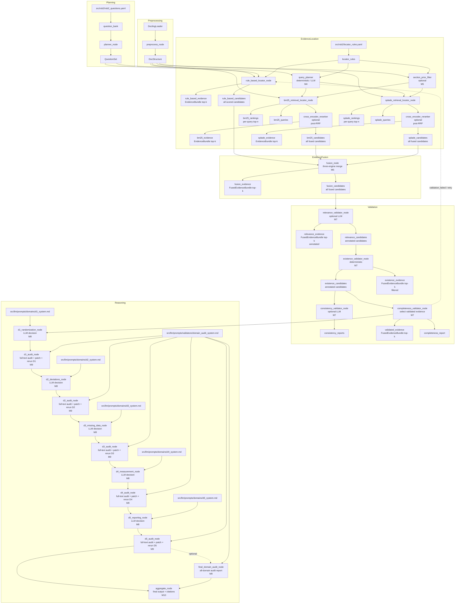
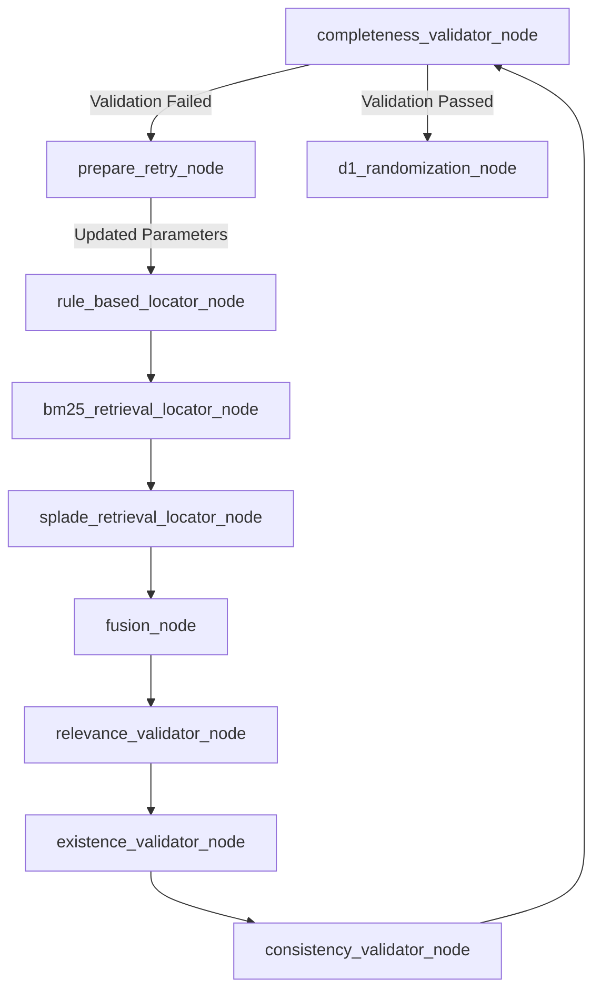
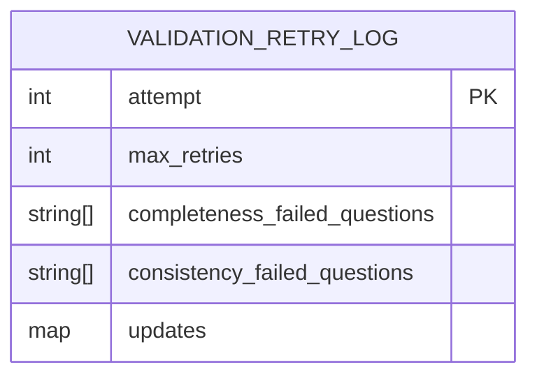

# Retry and Rollback Mechanism

<cite>
**Referenced Files in This Document**   
- [rob2_graph.py](file://src/pipelines/graphs/rob2_graph.py)
- [routing.py](file://src/pipelines/graphs/routing.py)
- [completeness.py](file://src/pipelines/graphs/nodes/validators/completeness.py)
- [consistency.py](file://src/pipelines/graphs/nodes/validators/consistency.py)
- [existence.py](file://src/pipelines/graphs/nodes/validators/existence.py)
- [relevance.py](file://src/pipelines/graphs/nodes/validators/relevance.py)
- [rule_based.py](file://src/pipelines/graphs/nodes/locators/rule_based.py)
- [retrieval_bm25.py](file://src/pipelines/graphs/nodes/locators/retrieval_bm25.py)
- [retrieval_splade.py](file://src/pipelines/graphs/nodes/locators/retrieval_splade.py)
- [fusion.py](file://src/pipelines/graphs/nodes/fusion.py)
- [rob2_runner.py](file://src/services/rob2_runner.py)
- [system-uml.md](file://docs/system-uml.md)
</cite>

## Table of Contents
1. [Introduction](#introduction)
2. [Workflow Overview](#workflow-overview)
3. [Validation Retry and Rollback Mechanism](#validation-retry-and-rollback-mechanism)
4. [Progressive Relaxation Strategy](#progressive-relaxation-strategy)
5. [Validation Retry Log Structure](#validation-retry-log-structure)
6. [Recursion Limit Configuration](#recursion-limit-configuration)
7. [Practical Examples](#practical-examples)
8. [Common Issues and Mitigations](#common-issues-and-mitigations)
9. [Conclusion](#conclusion)

## Introduction
This document details the validation retry and rollback mechanism implemented in the ROB2 workflow system. The mechanism ensures robust evidence retrieval by automatically rolling back to the evidence location phase when validation fails, and progressively relaxing retrieval parameters across retry attempts to improve evidence quality. The system employs a structured retry strategy with configurable relaxation rules, comprehensive logging, and safeguards against infinite loops.

**Section sources**
- [rob2_graph.py](file://src/pipelines/graphs/rob2_graph.py#L1-L426)

## Workflow Overview
The ROB2 workflow follows a multi-stage process from document preprocessing through evidence retrieval, validation, and final reasoning. The validation phase (Milestone 7) serves as a critical quality gate before proceeding to domain-specific reasoning (Milestone 8). When validation fails, the system implements an automatic rollback to the evidence location layer, enabling parameter adjustments and reprocessing.



**Diagram sources **
- [system-uml.md](file://docs/system-uml.md#L3-L104)

**Section sources**
- [rob2_graph.py](file://src/pipelines/graphs/rob2_graph.py#L288-L426)
- [system-uml.md](file://docs/system-uml.md#L3-L104)

## Validation Retry and Rollback Mechanism
The validation retry and rollback mechanism is triggered when the completeness validation fails during Milestone 7. The system automatically rolls back to the evidence location phase, allowing for parameter adjustments and reprocessing of evidence retrieval. This mechanism is implemented through conditional routing in the LangGraph workflow.

The `validation_should_retry` function in the routing module determines whether to retry based on validation outcomes and retry budget. When validation fails and retry attempts remain, the workflow routes back to the rule-based locator node, effectively restarting the evidence location process with updated parameters.



**Diagram sources **
- [rob2_graph.py](file://src/pipelines/graphs/rob2_graph.py#L395-L399)
- [routing.py](file://src/pipelines/graphs/routing.py#L28-L43)

**Section sources**
- [rob2_graph.py](file://src/pipelines/graphs/rob2_graph.py#L216-L285)
- [routing.py](file://src/pipelines/graphs/routing.py#L28-L43)
- [completeness.py](file://src/pipelines/graphs/nodes/validators/completeness.py#L20-L139)

## Progressive Relaxation Strategy
The system implements a progressive relaxation strategy through the `prepare_validation_retry_node` function, which systematically modifies configuration parameters to increase the likelihood of successful validation on subsequent attempts.

### First Retry: Disable Structure-Aware Retrieval
On the first retry attempt, the system disables structure-aware retrieval by setting `use_structure` to `False`. This allows the retrieval process to consider the entire document without section-based filtering, potentially capturing evidence that might have been excluded due to strict section priors.

### Parameter Adjustments
For each retry attempt, the system applies the following parameter adjustments:

- **per_query_top_n**: Doubled (capped at 200) to retrieve more candidates per query
- **top_k**: Increased by 3 (capped at 10) to consider more top candidates
- **fusion_top_k**: Updated to match the new top_k value

### Validation Requirement Relaxation
When `validation_relax_on_retry` is enabled (default), the system relaxes validation requirements:

- **completeness_require_relevance**: Set to `False` to bypass relevance filtering
- **relevance_min_confidence**: Set to 0.3 (down from default 0.6)
- **relevance_require_quote**: Set to `False` to not require supporting quotes
- **existence_require_text_match**: Set to `False` to relax text matching requirements
- **existence_require_quote_in_source**: Set to `False` to not require quotes in source

```mermaid
flowchart TD
Start[Validation Failed] --> Attempt{Attempt = 1?}
Attempt --> |Yes| DisableStructure[Set use_structure = False]
Attempt --> |No| SkipStructure[Keep current use_structure]
DisableStructure --> AdjustParams[Adjust Parameters]
SkipStructure --> AdjustParams
AdjustParams --> DoubleTopN[Double per_query_top_n<br/>(max 200)]
AdjustParams --> IncreaseTopK[Increase top_k by 3<br/>(max 10)]
AdjustParams --> UpdateFusion[Set fusion_top_k = top_k]
DoubleTopN --> CheckRelax[relax_on_retry?]
IncreaseTopK --> CheckRelax
UpdateFusion --> CheckRelax
CheckRelax --> |Yes| RelaxValidation[Relax Validation Requirements]
CheckRelax --> |No| SkipRelax[Keep current requirements]
RelaxValidation --> SetRelevance[completeness_require_relevance = False]
SetRelevance --> SetMinConf[relevance_min_confidence = 0.3]
SetMinConf --> SetQuote[relevance_require_quote = False]
SetQuote --> SetTextMatch[existence_require_text_match = False]
SetTextMatch --> SetSourceQuote[existence_require_quote_in_source = False]
SkipRelax --> Proceed[Proceed with current settings]
SetSourceQuote --> Proceed
Proceed --> UpdateState[Update State with New Parameters]
UpdateState --> Rollback[Rollback to Evidence Location]
```

**Diagram sources **
- [rob2_graph.py](file://src/pipelines/graphs/rob2_graph.py#L248-L271)
- [rob2_runner.py](file://src/services/rob2_runner.py#L242-L246)

**Section sources**
- [rob2_graph.py](file://src/pipelines/graphs/rob2_graph.py#L248-L271)
- [rob2_runner.py](file://src/services/rob2_runner.py#L242-L246)

## Validation Retry Log Structure
The system maintains a comprehensive validation retry log to track each retry attempt's parameters and outcomes. This log is stored in the `validation_retry_log` state variable and provides valuable insights for debugging and optimization.

The log structure includes:
- **attempt**: The retry attempt number (1-indexed)
- **max_retries**: The maximum number of retry attempts allowed
- **completeness_failed_questions**: List of questions that failed completeness validation
- **consistency_failed_questions**: List of questions that failed consistency validation
- **updates**: Dictionary of parameter updates applied for this retry

Each entry in the validation retry log captures the complete state of the retry attempt, enabling post-mortem analysis of the validation process. The log is accumulated across attempts through the `operator.add` annotation on the `validation_retry_log` field in the `Rob2GraphState` class.



**Diagram sources **
- [rob2_graph.py](file://src/pipelines/graphs/rob2_graph.py#L210-L211)
- [rob2_graph.py](file://src/pipelines/graphs/rob2_graph.py#L272-L285)
- [rob2_runner.py](file://src/services/rob2_runner.py#L355-L367)

**Section sources**
- [rob2_graph.py](file://src/pipelines/graphs/rob2_graph.py#L210-L211)
- [rob2_graph.py](file://src/pipelines/graphs/rob2_graph.py#L272-L285)
- [rob2_runner.py](file://src/services/rob2_runner.py#L355-L367)

## Recursion Limit Configuration
To support deep retry loops, the system configures a recursion limit of 100, significantly higher than LangGraph's default limit of 25. This configuration is necessary due to the complex workflow that includes multiple downstream nodes (Milestones 8+) beyond the retry loop.

The recursion limit is set in the `build_rob2_graph` function using the `with_config` method:

```python
return compiled.with_config({"recursion_limit": 100})
```

This elevated recursion limit ensures that the workflow can handle multiple retry attempts without triggering false positive recursion errors, even when combined with subsequent processing stages. The limit provides sufficient headroom for the retry mechanism while preventing potential infinite loops from consuming excessive resources.

**Section sources**
- [rob2_graph.py](file://src/pipelines/graphs/rob2_graph.py#L418-L422)

## Practical Examples
### Example 1: Initial Validation Failure
When the initial validation fails due to insufficient relevant evidence, the system triggers the retry mechanism. For a clinical trial document, if the initial retrieval only finds 2 relevant paragraphs for a question requiring 3, the system will:

1. Roll back to the evidence location phase
2. Disable structure-aware retrieval to broaden the search scope
3. Double `per_query_top_n` from 50 to 100 to retrieve more candidates
4. Increase `top_k` from 5 to 8 to consider more top results
5. Relax validation requirements to accept lower-confidence relevance scores

### Example 2: Multiple Retry Attempts
In cases where evidence is particularly difficult to locate, the system may require multiple retry attempts:

- **Attempt 1**: Disable structure-aware retrieval, double candidate retrieval
- **Attempt 2**: Further increase candidate counts, relax relevance requirements
- **Attempt 3**: Accept minimal evidence with lowest confidence thresholds

The progressive relaxation strategy increases the likelihood of finding acceptable evidence with each attempt, while the logging system provides transparency into the parameter adjustments made at each step.

**Section sources**
- [rob2_graph.py](file://src/pipelines/graphs/rob2_graph.py#L248-L271)
- [routing.py](file://src/pipelines/graphs/routing.py#L28-L43)
- [completeness.py](file://src/pipelines/graphs/nodes/validators/completeness.py#L20-L139)

## Common Issues and Mitigations
### Infinite Retry Loops
While the recursion limit of 100 prevents infinite recursion, there is still a risk of excessive retry attempts. The system mitigates this through:

- **Configurable retry budget**: The `validation_max_retries` parameter (default: 1) limits the number of retry attempts
- **Progressive relaxation**: Each retry attempt relaxes requirements, increasing the likelihood of eventual success
- **Final fallback**: After exhausting retries, the system proceeds with the best available evidence

### Performance Impacts
Multiple retry attempts can significantly increase processing time. The system addresses this through:

- **Caching**: Results from previous attempts are preserved where possible
- **Efficient parameter updates**: Only necessary parameters are modified between attempts
- **Parallel processing**: Retrieval engines operate in parallel during each attempt

### Evidence Quality Degradation
As validation requirements are relaxed, evidence quality may degrade. The system balances this by:

- **Structured relaxation**: Requirements are relaxed in a controlled, prioritized manner
- **Comprehensive logging**: The validation retry log enables post-hoc quality assessment
- **Final quality gate**: The reasoning phase (Milestone 8) serves as a final validation of evidence quality

**Section sources**
- [rob2_graph.py](file://src/pipelines/graphs/rob2_graph.py#L217-L218)
- [rob2_graph.py](file://src/pipelines/graphs/rob2_graph.py#L395-L399)
- [routing.py](file://src/pipelines/graphs/routing.py#L30-L43)

## Conclusion
The validation retry and rollback mechanism provides a robust approach to evidence retrieval in the ROB2 workflow system. By automatically rolling back to the evidence location phase when validation fails and progressively relaxing retrieval parameters, the system increases the likelihood of obtaining high-quality evidence while maintaining transparency through comprehensive logging. The mechanism is carefully balanced with safeguards against infinite loops and performance degradation, making it a reliable component of the overall workflow.

**Section sources**
- [rob2_graph.py](file://src/pipelines/graphs/rob2_graph.py#L1-L426)
- [routing.py](file://src/pipelines/graphs/routing.py#L1-L58)
- [rob2_runner.py](file://src/services/rob2_runner.py#L1-L443)