# State Management

<cite>
**Referenced Files in This Document**   
- [rob2_graph.py](file://src/pipelines/graphs/rob2_graph.py)
- [rob2.py](file://src/schemas/internal/rob2.py)
- [preprocess.py](file://src/pipelines/graphs/nodes/preprocess.py)
- [planner.py](file://src/pipelines/graphs/nodes/planner.py)
- [fusion.py](file://src/pipelines/graphs/nodes/fusion.py)
- [completeness.py](file://src/pipelines/graphs/nodes/validators/completeness.py)
- [domain_audit.py](file://src/pipelines/graphs/nodes/domain_audit.py)
- [routing.py](file://src/pipelines/graphs/routing.py)
- [evidence.py](file://src/schemas/internal/evidence.py)
- [documents.py](file://src/schemas/internal/documents.py)
</cite>

## Table of Contents
1. [Introduction](#introduction)
2. [State Schema Overview](#state-schema-overview)
3. [Document Processing Parameters](#document-processing-parameters)
4. [Retrieval Configuration](#retrieval-configuration)
5. [Validation Settings](#validation-settings)
6. [Domain Reasoning Models](#domain-reasoning-models)
7. [Audit Controls](#audit-controls)
8. [Workflow State Tracking](#workflow-state-tracking)
9. [State Reduction with Annotated Types](#state-reduction-with-annotated-types)
10. [State Evolution in Workflow Lifecycle](#state-evolution-in-workflow-lifecycle)
11. [Extending the State Schema](#extending-the-state-schema)
12. [Conclusion](#conclusion)

## Introduction

The Rob2GraphState TypedDict serves as the central data structure for managing state throughout the ROB2 assessment workflow. This comprehensive state object contains over 200 fields organized into logical categories that support document processing, evidence retrieval, validation, domain reasoning, audit controls, and workflow tracking. The state is designed to be both extensible and compatible with LangGraph's workflow engine, enabling complex orchestration of assessment steps while maintaining traceability and auditability.

**Section sources**
- [rob2_graph.py](file://src/pipelines/graphs/rob2_graph.py#L46-L425)

## State Schema Overview

The Rob2GraphState TypedDict defines a comprehensive schema that captures all configuration parameters, intermediate results, and workflow metadata needed for the ROB2 assessment process. The state is structured to support a multi-stage workflow that begins with document preprocessing and ends with final risk aggregation. The schema includes configuration parameters that propagate through nodes, validation settings that control quality gates, domain reasoning models for specialized analysis, audit controls for quality assurance, and workflow state tracking for monitoring execution progress.

```mermaid
classDiagram
class Rob2GraphState {
+str pdf_path
+dict doc_structure
+dict question_set
+str docling_layout_model
+str docling_artifacts_path
+str docling_chunker_model
+int docling_chunker_max_tokens
+int top_k
+int per_query_top_n
+int rrf_k
+Literal query_planner
+str query_planner_model
+str query_planner_model_provider
+float query_planner_temperature
+float query_planner_timeout
+int query_planner_max_tokens
+int query_planner_max_retries
+int query_planner_max_keywords
+Literal reranker
+str reranker_model_id
+str reranker_device
+int reranker_max_length
+int reranker_batch_size
+int rerank_top_n
+bool use_structure
+float section_bonus_weight
+str splade_model_id
+str splade_device
+str splade_hf_token
+int splade_query_max_length
+int splade_doc_max_length
+int splade_batch_size
+int fusion_top_k
+int fusion_rrf_k
+dict fusion_engine_weights
+Literal relevance_mode
+dict relevance_validator
+dict relevance_config
+dict relevance_debug
+float relevance_min_confidence
+bool relevance_require_quote
+bool relevance_fill_to_top_k
+int relevance_top_k
+int relevance_top_n
+str relevance_model
+str relevance_model_provider
+float relevance_temperature
+float relevance_timeout
+int relevance_max_tokens
+int relevance_max_retries
+object relevance_llm
+str d1_model
+str d1_model_provider
+float d1_temperature
+float d1_timeout
+int d1_max_tokens
+int d1_max_retries
+object d1_llm
+bool existence_require_text_match
+bool existence_require_quote_in_source
+int existence_top_k
+Literal consistency_mode
+dict consistency_validator
+dict consistency_config
+dict consistency_reports
+float consistency_min_confidence
+bool consistency_require_quotes_for_fail
+int consistency_top_n
+str consistency_model
+str consistency_model_provider
+float consistency_temperature
+float consistency_timeout
+int consistency_max_tokens
+int consistency_max_retries
+object consistency_llm
+str d2_model
+str d2_model_provider
+float d2_temperature
+float d2_timeout
+int d2_max_tokens
+int d2_max_retries
+object d2_llm
+Literal d2_effect_type
+str d3_model
+str d3_model_provider
+float d3_temperature
+float d3_timeout
+int d3_max_tokens
+int d3_max_retries
+object d3_llm
+str d4_model
+str d4_model_provider
+float d4_temperature
+float d4_timeout
+int d4_max_tokens
+int d4_max_retries
+object d4_llm
+str d5_model
+str d5_model_provider
+float d5_temperature
+float d5_timeout
+int d5_max_tokens
+int d5_max_retries
+object d5_llm
+Literal domain_audit_mode
+str domain_audit_model
+str domain_audit_model_provider
+float domain_audit_temperature
+float domain_audit_timeout
+int domain_audit_max_tokens
+int domain_audit_max_retries
+int domain_audit_patch_window
+int domain_audit_max_patches_per_question
+bool domain_audit_rerun_domains
+bool domain_audit_final
+object domain_audit_llm
+dict domain_audit_report
+Annotated list[dict] domain_audit_reports
+dict rob2_result
+str rob2_table_markdown
+bool completeness_enforce
+int completeness_min_passed_per_question
+bool completeness_require_relevance
+list[str] completeness_required_questions
+int validated_top_k
+int domain_evidence_top_k
+dict rule_based_candidates
+dict bm25_candidates
+dict splade_candidates
+dict fulltext_candidates
+dict fusion_candidates
+dict relevance_candidates
+dict existence_candidates
+list[dict] validated_evidence
+dict validated_candidates
+list[dict] completeness_report
+dict completeness_config
+bool completeness_passed
+list[str] completeness_failed_questions
+list[str] consistency_failed_questions
+dict d1_decision
+dict d2_decision
+dict d3_decision
+dict d4_decision
+dict d5_decision
+int validation_attempt
+int validation_max_retries
+bool validation_fail_on_consistency
+bool validation_relax_on_retry
+Annotated list[dict] validation_retry_log
}
```



**Diagram sources**
- [rob2_graph.py](file://src/pipelines/graphs/rob2_graph.py#L46-L210)

## Document Processing Parameters

The document processing parameters in Rob2GraphState control the preprocessing pipeline that converts PDF documents into structured data. These parameters include configuration for the Docling layout model, artifacts path, chunker model, and maximum tokens for chunking. The `pdf_path` field specifies the input document location, while `doc_structure` contains the normalized document structure after preprocessing. The `docling_layout_model` and `docling_artifacts_path` fields allow customization of the document layout analysis model, enabling users to select different models based on their document types and processing requirements.

The `docling_chunker_model` and `docling_chunker_max_tokens` parameters control how the document is segmented into chunks for downstream processing. These settings are critical for ensuring that evidence retrieval and validation steps operate on appropriately sized text segments. The preprocessing node uses these parameters to configure the Docling converter and chunker, which are cached for efficiency when processing multiple documents.

**Section sources**
- [rob2_graph.py](file://src/pipelines/graphs/rob2_graph.py#L47-L54)
- [preprocess.py](file://src/pipelines/graphs/nodes/preprocess.py#L28-L36)

## Retrieval Configuration

The retrieval configuration fields in Rob2GraphState control the evidence location process, which combines multiple retrieval strategies to identify relevant document sections. The configuration includes parameters for BM25 and SPLADE retrieval engines, fusion algorithms, and reranking. The `top_k` parameter determines the number of top candidates to retain at each stage, while `per_query_top_n` controls the initial number of candidates retrieved per query.

The retrieval system supports multiple query planning strategies through the `query_planner` parameter, which can be set to "deterministic" or "llm". When using LLM-based query planning, parameters like `query_planner_model`, `query_planner_temperature`, and `query_planner_max_tokens` control the LLM behavior. The reranking configuration includes settings for cross-encoder models, with parameters for model ID, device, batch size, and maximum length.

The fusion configuration (`fusion_top_k`, `fusion_rrf_k`, `fusion_engine_weights`) determines how candidates from different retrieval engines are combined. The RRF (Reciprocal Rank Fusion) algorithm uses the `rrf_k` parameter to control the fusion behavior, while `fusion_engine_weights` allows for weighted combination of results from different engines.

**Section sources**
- [rob2_graph.py](file://src/pipelines/graphs/rob2_graph.py#L55-L83)
- [fusion.py](file://src/pipelines/graphs/nodes/fusion.py#L16-L83)

## Validation Settings

The validation settings in Rob2GraphState control the quality assurance process that verifies the completeness, relevance, existence, and consistency of retrieved evidence. These settings include configuration for four validation modes: relevance, existence, consistency, and completeness. The `relevance_mode` parameter can be set to "none" or "llm" to enable or disable LLM-based relevance scoring.

The relevance validation configuration includes parameters like `relevance_min_confidence`, `relevance_require_quote`, and `relevance_top_k` that control the strictness of relevance filtering. The existence validation settings (`existence_require_text_match`, `existence_require_quote_in_source`) determine how strictly existence claims are verified. The consistency validation configuration includes `consistency_min_confidence` and `consistency_require_quotes_for_fail` to control conflict detection sensitivity.

The completeness validation settings are particularly important, with parameters like `completeness_enforce`, `completeness_min_passed_per_question`, and `completeness_required_questions` that define the completeness criteria. The `validated_top_k` parameter controls how many validated candidates are retained for downstream processing.

**Section sources**
- [rob2_graph.py](file://src/pipelines/graphs/rob2_graph.py#L85-L125)
- [completeness.py](file://src/pipelines/graphs/nodes/validators/completeness.py#L20-L125)

## Domain Reasoning Models

The domain reasoning model parameters in Rob2GraphState configure the LLM-based analysis for each of the five ROB2 domains (D1-D5). Each domain has its own set of model configuration parameters, including model ID, provider, temperature, timeout, maximum tokens, and maximum retries. For example, the D1 domain uses parameters prefixed with `d1_` such as `d1_model`, `d1_temperature`, and `d1_max_tokens`.

The domain reasoning nodes use these parameters to configure the LLM for specialized analysis of each bias domain. The `d2_effect_type` parameter is unique to the D2 domain, allowing selection between "assignment" and "adherence" analysis modes. The `domain_evidence_top_k` parameter controls how many pieces of evidence are provided to each domain reasoning node, balancing comprehensiveness with context window limitations.

These model parameters propagate through the workflow, allowing each domain reasoning node to use the appropriate model configuration. The LLM configuration can be overridden at runtime through the state, enabling dynamic selection of models based on document characteristics or user preferences.

**Section sources**
- [rob2_graph.py](file://src/pipelines/graphs/rob2_graph.py#L101-L158)
- [d1_randomization.py](file://src/pipelines/graphs/nodes/domains/d1_randomization.py#L15-L44)
- [d2_deviations.py](file://src/pipelines/graphs/nodes/domains/d2_deviations.py#L16-L54)

## Audit Controls

The audit controls in Rob2GraphState enable a quality assurance process that verifies domain reasoning results against a full-text analysis. The `domain_audit_mode` parameter controls whether audit is enabled, with options for "none" or "llm". When enabled, the audit process uses a separate LLM configured through parameters like `domain_audit_model`, `domain_audit_temperature`, and `domain_audit_max_tokens`.

The audit configuration includes parameters for patching retrieved evidence, with `domain_audit_patch_window` controlling how many surrounding paragraphs are included when patching, and `domain_audit_max_patches_per_question` limiting the number of patches applied. The `domain_audit_rerun_domains` parameter determines whether domains are automatically re-run when audit patches are applied, creating a feedback loop for continuous improvement.

The `domain_audit_final` parameter controls whether a final comprehensive audit is performed after all domain analyses, providing an additional quality check. The audit process generates detailed reports stored in `domain_audit_report` and accumulates them in `domain_audit_reports` through state reduction.

**Section sources**
- [rob2_graph.py](file://src/pipelines/graphs/rob2_graph.py#L160-L173)
- [domain_audit.py](file://src/pipelines/graphs/nodes/domain_audit.py#L98-L243)

## Workflow State Tracking

The workflow state tracking fields in Rob2GraphState monitor the execution progress and control flow of the assessment pipeline. The `validation_attempt` field tracks the current retry attempt number, while `validation_max_retries` sets the maximum number of allowed retries. These fields enable the validation retry mechanism, which automatically adjusts retrieval parameters when validation fails.

The `completeness_passed` boolean indicates whether the completeness validation was successful, while `completeness_failed_questions` and `consistency_failed_questions` lists identify specific questions that failed validation. The `rob2_result` field contains the final assessment results, and `rob2_table_markdown` stores a formatted version suitable for reporting.

The state tracking also includes intermediate results from each processing stage, such as `rule_based_candidates`, `bm25_candidates`, `fusion_candidates`, and `validated_candidates`, which provide visibility into the evidence retrieval and validation process. The domain-specific decision fields (`d1_decision`, `d2_decision`, etc.) store the results of each domain analysis.

**Section sources**
- [rob2_graph.py](file://src/pipelines/graphs/rob2_graph.py#L175-L210)
- [routing.py](file://src/pipelines/graphs/routing.py#L28-L43)

## State Reduction with Annotated Types

The Rob2GraphState utilizes Annotated types to implement state reduction, which automatically combines values from multiple workflow iterations. The `validation_retry_log` field is annotated with `Annotated[list[dict], operator.add]`, causing retry logs from different attempts to be concatenated. Similarly, `domain_audit_reports` uses the same annotation to accumulate audit reports across multiple audit steps.

This state reduction mechanism is essential for maintaining a complete history of workflow execution while avoiding data loss during retries and iterations. When the validation process retries due to failed completeness checks, the new retry log entry is appended to the existing log rather than replacing it. This allows for comprehensive analysis of the entire validation process, including all attempts and their outcomes.

The use of operator.add for list concatenation ensures that the state grows incrementally, preserving the temporal sequence of events. This is particularly valuable for debugging and auditing, as it provides a complete record of how the assessment evolved through multiple iterations.

**Section sources**
- [rob2_graph.py](file://src/pipelines/graphs/rob2_graph.py#L173-L174)
- [rob2_graph.py](file://src/pipelines/graphs/rob2_graph.py#L210-L211)

## State Evolution in Workflow Lifecycle

The Rob2GraphState evolves systematically throughout the workflow lifecycle, with different fields being populated and modified at each stage. The lifecycle begins with document preprocessing, where the `pdf_path` is used to generate the `doc_structure`. The planner node then populates the `question_set` with the standardized ROB2 questions.

During evidence retrieval, the state accumulates candidates from multiple sources in fields like `rule_based_candidates`, `bm25_candidates`, and `splade_candidates`. The fusion node combines these into `fusion_candidates`, which are then validated through relevance, existence, and consistency checks, ultimately producing `validated_candidates`.

When validation fails, the `_prepare_validation_retry_node` modifies key parameters like `use_structure`, `per_query_top_n`, and `top_k` to improve retrieval in subsequent attempts. The validation retry log captures these changes, showing how the configuration evolves to overcome validation failures.

The domain reasoning phase populates the domain-specific decision fields (`d1_decision`, etc.), which are then subject to audit. If the audit identifies discrepancies, it patches the `validated_candidates` and optionally re-runs the affected domain, demonstrating the feedback-driven nature of the workflow.

```mermaid
sequenceDiagram
participant Preprocess as Preprocess Node
participant Planner as Planner Node
participant Retrieval as Retrieval Nodes
participant Fusion as Fusion Node
participant Validation as Validation Nodes
participant Domain as Domain Nodes
participant Audit as Audit Node
Preprocess->>Preprocess : Initialize with pdf_path
Preprocess->>Planner : Output doc_structure
Planner->>Planner : Initialize question_set
Planner->>Retrieval : Pass question_set
Retrieval->>Retrieval : Populate rule_based_candidates<br/>bm25_candidates<br/>splade_candidates
Retrieval->>Fusion : Pass candidates
Fusion->>Fusion : Generate fusion_candidates
Fusion->>Validation : Pass fusion_candidates
Validation->>Validation : Generate validated_candidates<br/>completeness_report
alt Validation Fails
Validation->>Validation : Increment validation_attempt
Validation->>Validation : Update retrieval parameters
Validation->>Retrieval : Retry with new configuration
else Validation Passes
Validation->>Domain : Pass validated_candidates
Domain->>Domain : Generate d1_decision, d2_decision, etc.
Domain->>Audit : Pass decisions
Audit->>Audit : Compare with full-text analysis
alt Discrepancies Found
Audit->>Audit : Patch validated_candidates
Audit->>Domain : Re-run domain analysis
end
Audit->>End : Output final rob2_result
end
```

**Diagram sources**
- [rob2_graph.py](file://src/pipelines/graphs/rob2_graph.py#L288-L422)
- [routing.py](file://src/pipelines/graphs/routing.py#L28-L43)

## Extending the State Schema

The Rob2GraphState schema can be extended to support custom nodes while maintaining compatibility with the core workflow. Custom extensions should follow the existing naming conventions, using descriptive prefixes to indicate their purpose. For example, a custom retrieval engine could add fields prefixed with `custom_retrieval_`.

When extending the schema, it's important to consider state reduction for list fields that may accumulate data across workflow iterations. Using Annotated types with appropriate operators (like operator.add for concatenation) ensures that custom state fields behave consistently with built-in fields.

Custom nodes can access and modify existing state fields as needed, but should avoid modifying fields that are critical to the core workflow unless explicitly designed to do so. The state's flexibility allows for the addition of new validation steps, alternative reasoning models, or enhanced audit capabilities without disrupting the existing workflow.

Extensions should be documented with clear descriptions of their purpose, expected values, and impact on the workflow. This ensures that the extended state remains maintainable and understandable to other developers and users.

## Conclusion

The Rob2GraphState TypedDict provides a comprehensive and flexible foundation for managing state in the ROB2 assessment workflow. With over 200 fields organized into logical categories, it supports a sophisticated multi-stage process that combines document processing, evidence retrieval, validation, domain reasoning, and audit controls. The use of Annotated types for state reduction enables accumulation of historical data across workflow iterations, while the structured organization of parameters facilitates configuration and debugging.

The state schema is designed to be both comprehensive and extensible, allowing for the addition of custom nodes and capabilities while maintaining compatibility with the core workflow. Its evolution throughout the workflow lifecycle demonstrates a sophisticated approach to workflow management, with feedback loops and adaptive behavior that improve assessment quality through iterative refinement.