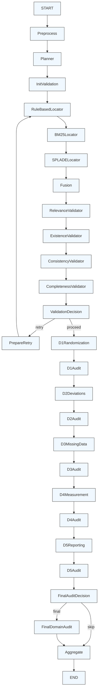
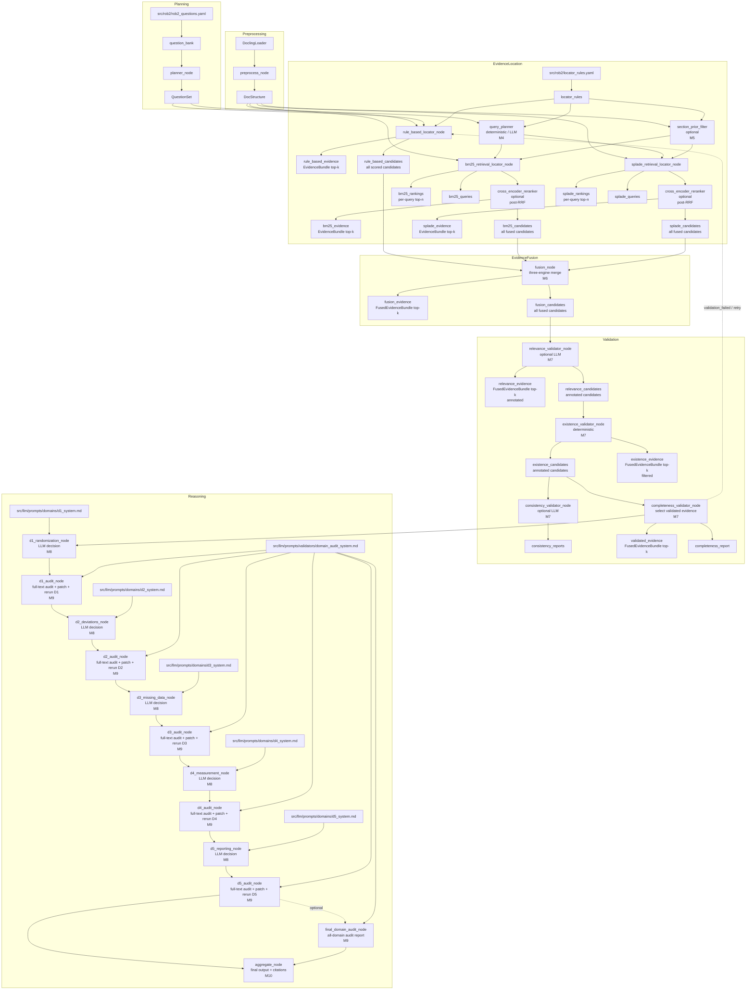

# Workflow Overview

<cite>
**Referenced Files in This Document**   
- [rob2_graph.py](file://src/pipelines/graphs/rob2_graph.py)
- [system-uml.md](file://docs/system-uml.md)
- [preprocess.py](file://src/pipelines/graphs/nodes/preprocess.py)
- [planner.py](file://src/pipelines/graphs/nodes/planner.py)
- [fusion.py](file://src/pipelines/graphs/nodes/fusion.py)
- [relevance.py](file://src/pipelines/graphs/nodes/validators/relevance.py)
- [completeness.py](file://src/pipelines/graphs/nodes/validators/completeness.py)
- [domain_audit.py](file://src/pipelines/graphs/nodes/domain_audit.py)
- [aggregate.py](file://src/pipelines/graphs/nodes/aggregate.py)
- [rob2.py](file://src/schemas/internal/rob2.py)
- [routing.py](file://src/pipelines/graphs/routing.py)
</cite>

## Table of Contents
1. [Introduction](#introduction)
2. [State Management](#state-management)
3. [Node Definitions](#node-definitions)
4. [Edge Routing and Conditional Logic](#edge-routing-and-conditional-logic)
5. [Workflow Sequence](#workflow-sequence)
6. [Data Flow and Component Interactions](#data-flow-and-component-interactions)
7. [Critical Architectural Decisions](#critical-architectural-decisions)
8. [Scalability and Performance](#scalability-and-performance)
9. [Infrastructure and Deployment](#infrastructure-and-deployment)

## Introduction
The LangGraph workflow engine implements a sophisticated evidence-based reasoning system for ROB2 (Risk of Bias 2) assessment in clinical trials. This document provides a comprehensive architectural overview of the StateGraph defined in rob2_graph.py, detailing its node definitions, edge routing, conditional logic, and overall workflow from document preprocessing through final result aggregation. The system orchestrates a complex sequence of operations including evidence location, fusion, validation, domain reasoning, and audit processes, all managed through a centralized state object with over 200 fields.

## State Management
The workflow is built around the Rob2GraphState TypedDict, which serves as the central state management mechanism. This state object contains over 200 fields that track every aspect of the workflow's progress, configuration, and results. The state is designed to be comprehensive, containing parameters for all system components including preprocessing, retrieval, validation, reasoning, and auditing.

The state structure includes configuration parameters for various components such as document parsing (docling_layout_model, docling_artifacts_path), retrieval engines (top_k, per_query_top_n, rrf_k), LLM settings (various model, temperature, timeout, and max_tokens parameters), validation rules (completeness_enforce, completeness_min_passed_per_question), and audit configurations (domain_audit_mode, domain_audit_patch_window). It also tracks intermediate results like rule_based_candidates, bm25_candidates, splade_candidates, fusion_candidates, relevance_candidates, existence_candidates, validated_evidence, and domain-specific decisions (d1_decision through d5_decision).

Two special state initialization functions, _init_validation_state_node and _prepare_validation_retry_node, manage the validation state and retry mechanics. The validation state includes attempt tracking (validation_attempt, validation_max_retries), failure conditions (validation_fail_on_consistency), and relaxation strategies for retries (validation_relax_on_retry). The state also supports accumulation of data across iterations through Annotated types with operator.add, such as domain_audit_reports and validation_retry_log.

**Section sources**
- [rob2_graph.py](file://src/pipelines/graphs/rob2_graph.py#L46-L210)

## Node Definitions
The workflow consists of a series of nodes that perform specific functions in the evidence assessment pipeline. Each node is a self-contained function that takes the current state as input and returns updates to the state.

The preprocessing phase begins with preprocess_node, which uses Docling to parse PDF documents into a structured format with metadata including paragraph IDs, titles, pages, and bounding boxes. This is followed by planner_node, which loads the standardized ROB2 question set from the question bank.

The evidence location phase includes multiple retrieval strategies: rule_based_locator_node applies rule-based matching to find relevant text passages, while bm25_retrieval_locator_node and splade_retrieval_locator_node use BM25 and SPLADE retrieval engines respectively. These locators support optional cross-encoder reranking and structure-aware filtering.

The evidence fusion phase is handled by fusion_node, which combines candidates from multiple retrieval engines using Reciprocal Rank Fusion (RRF) with configurable engine weights. This creates a unified set of evidence candidates ranked by relevance.

The validation phase consists of a series of validators: relevance_validator_node uses an LLM to assess the relevance of evidence to specific questions, existence_validator_node verifies that evidence exists in the document structure, consistency_validator_node checks for contradictions across multiple evidence pieces, and completeness_validator_node ensures sufficient evidence is available for each question.

The reasoning phase includes domain-specific nodes: d1_randomization_node, d2_deviations_node, d3_missing_data_node, d4_measurement_node, and d5_reporting_node, each applying domain-specific logic to make risk assessments. These are followed by audit nodes (d1_audit_node through d5_audit_node) that perform full-text audits and can patch evidence and re-run domain assessments.

The workflow concludes with aggregate_node, which compiles all results into the final output format.

**Section sources**
- [rob2_graph.py](file://src/pipelines/graphs/rob2_graph.py#L288-L378)
- [preprocess.py](file://src/pipelines/graphs/nodes/preprocess.py#L28-L36)
- [planner.py](file://src/pipelines/graphs/nodes/planner.py#L8-L11)
- [fusion.py](file://src/pipelines/graphs/nodes/fusion.py#L16-L83)
- [relevance.py](file://src/pipelines/graphs/nodes/validators/relevance.py#L24-L174)
- [completeness.py](file://src/pipelines/graphs/nodes/validators/completeness.py#L20-L116)
- [domain_audit.py](file://src/pipelines/graphs/nodes/domain_audit.py#L98-L117)
- [aggregate.py](file://src/pipelines/graphs/nodes/aggregate.py#L32-L109)

## Edge Routing and Conditional Logic
The workflow's control flow is defined by a combination of direct edges and conditional routing. The primary execution path follows a linear sequence from preprocessing through to aggregation, with conditional branches for retry mechanisms and optional audit steps.

The graph begins with a linear sequence: START → preprocess → planner → init_validation → rule_based_locator → bm25_locator → splade_locator → fusion → relevance_validator → existence_validator → consistency_validator → completeness_validator. After the completeness validation, conditional routing determines whether to proceed or retry.

The validation_should_retry function implements the retry logic, routing to "retry" if validation fails and retry attempts remain, or to "proceed" if validation passes or maximum retries are exhausted. When retrying, the workflow routes through prepare_retry to adjust parameters and then back to rule_based_locator to restart evidence location.

After the domain reasoning nodes (d1_randomization through d5_reporting), another conditional branch occurs at d5_audit, where domain_audit_should_run_final determines whether to execute the final_domain_audit_node based on the domain_audit_mode and domain_audit_final settings.

**Diagram sources**
- [rob2_graph.py](file://src/pipelines/graphs/rob2_graph.py#L382-L416)
- [routing.py](file://src/pipelines/graphs/routing.py#L28-L43)

## Workflow Sequence
The workflow executes in a well-defined sequence that progresses from document preprocessing through final result aggregation. The process begins with document preprocessing, where the input PDF is parsed into a structured format using Docling. This creates a doc_structure object containing the document's text, sections, and metadata.

Next, the question planning phase loads the standardized ROB2 question set from the question bank. This defines the assessment framework for the subsequent analysis.

The evidence location phase employs three complementary strategies: rule-based matching, BM25 retrieval, and SPLADE retrieval. The rule-based approach uses predefined rules to identify relevant text passages, while the retrieval engines use statistical and semantic methods to find relevant content. Each locator produces a set of candidates that are then fused together.

Evidence fusion combines the candidates from all retrieval engines using Reciprocal Rank Fusion with configurable weights. This creates a unified ranking of evidence that leverages the strengths of each retrieval method.

The validation phase applies a series of checks to ensure evidence quality. Relevance validation uses an LLM to assess whether evidence is relevant to the question. Existence validation verifies that cited evidence actually exists in the document. Consistency validation checks for contradictions across multiple evidence pieces. Completeness validation ensures sufficient evidence is available for each question.

If validation fails, the workflow can retry with adjusted parameters, such as expanding the search scope or relaxing validation criteria. This retry mechanism is a key feature that improves robustness.

The domain reasoning phase applies specialized logic to each of the five ROB2 domains (D1-D5), making risk assessments based on the validated evidence. Each domain assessment is followed by an optional audit step that can patch the evidence and re-run the assessment.

Finally, the aggregation phase compiles all results into the final output format, including risk assessments, supporting evidence, and citations.

**Section sources**
- [rob2_graph.py](file://src/pipelines/graphs/rob2_graph.py#L382-L416)
- [system-uml.md](file://docs/system-uml.md#L5-L120)

## Data Flow and Component Interactions
The system's data flow is visualized in the system-uml.md diagram, which shows the interactions between components and the flow of data through the workflow. The architecture follows a pipeline pattern with clear separation of concerns between stages.

The preprocessing stage transforms raw PDF input into a structured document representation. The planning stage loads the assessment framework. The evidence location stage produces multiple sets of candidates from different retrieval methods. These are then fused into a unified set of evidence.

Validation transforms the fused evidence by annotating it with relevance, existence, consistency, and completeness assessments. The validated evidence then flows into the domain reasoning stage, where specialized nodes make risk assessments for each domain.

The audit stage reads the full document and can patch the validated evidence, creating a feedback loop that improves assessment quality. Finally, the aggregation stage compiles all results into the final output.

Data flows through the system as state updates, with each node consuming and producing specific state fields. For example, the fusion node consumes rule_based_candidates, bm25_candidates, and splade_candidates, and produces fusion_candidates and fusion_evidence. The validation nodes consume fusion_candidates and produce relevance_candidates, existence_candidates, and validated_evidence.

**Diagram sources**
- [system-uml.md](file://docs/system-uml.md#L3-L102)

## Critical Architectural Decisions
Several key architectural decisions shape the system's behavior and capabilities. The most significant is the retry mechanism for validation failures, which allows the workflow to automatically adjust its parameters and retry evidence location when initial validation fails. This is implemented through the validation_should_retry routing function and the _prepare_validation_retry_node, which progressively relaxes constraints and expands search parameters on each retry.

Another critical decision is the conditional execution of audit steps. The domain_audit_should_run_final function determines whether to execute the final_domain_audit_node based on configuration settings, allowing users to control the thoroughness of the audit process. The audit nodes themselves implement a sophisticated feedback mechanism where they can patch the validated evidence and immediately re-run the corresponding domain assessment, creating a self-correcting system.

The state management design, with over 200 fields in Rob2GraphState, enables comprehensive tracking of workflow progress and configuration. This centralized state approach simplifies data flow and makes the system's behavior more predictable and debuggable.

The modular node design allows for easy extension and customization. Each node is a self-contained function that can be overridden or replaced, enabling customization of specific workflow components without affecting the overall structure.

The use of LangGraph's StateGraph provides a robust foundation for managing complex workflows with conditional routing and state persistence. The high recursion limit (100) accommodates the retry mechanism and complex control flow.

**Section sources**
- [rob2_graph.py](file://src/pipelines/graphs/rob2_graph.py#L248-L285)
- [routing.py](file://src/pipelines/graphs/routing.py#L28-L57)
- [domain_audit.py](file://src/pipelines/graphs/nodes/domain_audit.py#L238-L243)

## Scalability and Performance
The architecture incorporates several features to support scalability and performance optimization. The workflow is designed to be stateless and idempotent, allowing for easy parallelization of assessments across multiple documents.

The retrieval system supports multiple engines (rule-based, BM25, SPLADE) that can be configured and weighted according to performance characteristics. The fusion mechanism combines results from multiple engines, leveraging their complementary strengths.

Caching is implemented at multiple levels, including document conversion and chunking in the preprocessing stage, and question bank loading in the planning stage. This reduces redundant computation when processing similar documents.

The system supports configurable resource limits for LLM operations, including timeout, max_tokens, and max_retries parameters for each LLM invocation. This helps prevent individual operations from consuming excessive resources.

Performance can be optimized by adjusting various parameters, such as top_k (number of results to return), per_query_top_n (number of candidates to consider per query), and rrf_k (Reciprocal Rank Fusion parameter). The retry mechanism's parameter relaxation strategy also contributes to performance by starting with conservative settings and only expanding when necessary.

The architecture supports optional components like cross-encoder reranking and LLM-based validation, which can be disabled to improve performance when high precision is not required.

**Section sources**
- [rob2_graph.py](file://src/pipelines/graphs/rob2_graph.py#L55-L80)
- [rob2_runner.py](file://src/services/rob2_runner.py#L84-L106)

## Infrastructure and Deployment
The system is designed for flexible deployment in various environments. The core requirements include Python 3.8+, LangGraph, Docling, and various retrieval and LLM libraries. Specific dependencies include langchain-docling for document parsing, sentence-transformers for embedding models, and transformers for tokenizer functionality.

Deployment topology recommendations include separating compute-intensive components (retrieval, LLM inference) from coordination components (workflow orchestration). This allows for independent scaling of different system components based on workload characteristics.

For production deployment, it is recommended to use a containerized architecture with separate services for document preprocessing, retrieval, LLM inference, and workflow orchestration. This enables independent scaling and maintenance of each component.

The system supports both local and remote LLM inference, allowing deployment with local models for privacy-sensitive applications or cloud-based models for high-performance requirements. Configuration is managed through environment variables and state parameters, enabling easy adaptation to different deployment environments.

Monitoring and logging should be implemented to track workflow progress, identify bottlenecks, and debug issues. The comprehensive state object provides rich data for monitoring and analysis.

**Section sources**
- [rob2_graph.py](file://src/pipelines/graphs/rob2_graph.py#L50-L80)
- [rob2_runner.py](file://src/services/rob2_runner.py#L115-L123)
- [preprocess.py](file://src/pipelines/graphs/nodes/preprocess.py#L114-L157)