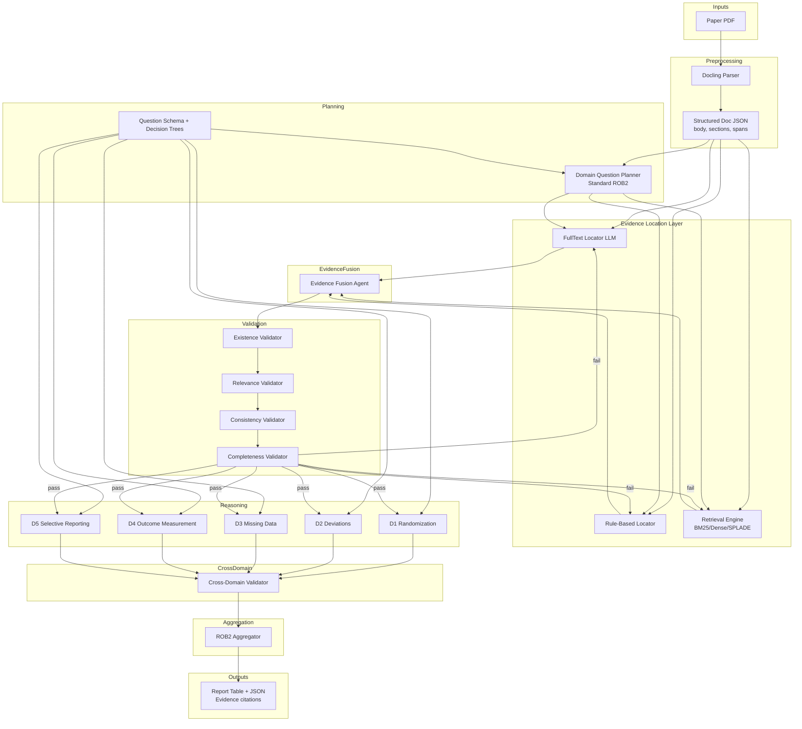

# ROB2 Target System Architecture (Standard)

This diagram captures the intended end-to-end architecture described in the requirements.
Scope is **Standard ROB2 only** (no trial-type branching).

Render with any Mermaid-compatible viewer (e.g., `npx @mermaid-js/mermaid-cli -i docs/system-architecture.md -o architecture.svg`).

### Interface Contracts (Data Schemas)

* **DocStructure**: `{ body: str, sections: list[SectionSpan], <section_title>: str }`
* **QuestionSet**: `list[{ question_id, domain, text, section_prior? }]`
* **EvidenceCandidate**: `{ question_id, paragraph_id, text, source, score? }`
* **EvidenceBundle**: `{ question_id, items: list[EvidenceCandidate] }`
* **ValidatedEvidence**: `{ question_id, items, status, failure_reason? }`
* **DomainDecision**: `{ domain, answers, risk, evidence_refs }`
* **FinalReport**: `{ domain_results, overall_risk, citations, json }`
