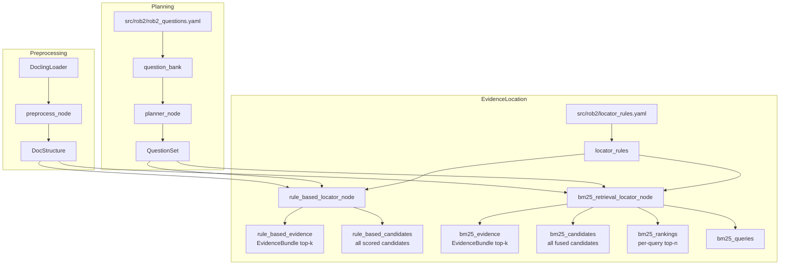

# System UML (Current Implementation)

Notes:
- This diagram reflects the currently implemented nodes and data flow in code.
- Evidence location currently includes rule-based and BM25 retrieval locators.
- Dense/SPLADE/fulltext locators, fusion, validation, reasoning, and aggregation are not implemented yet.
