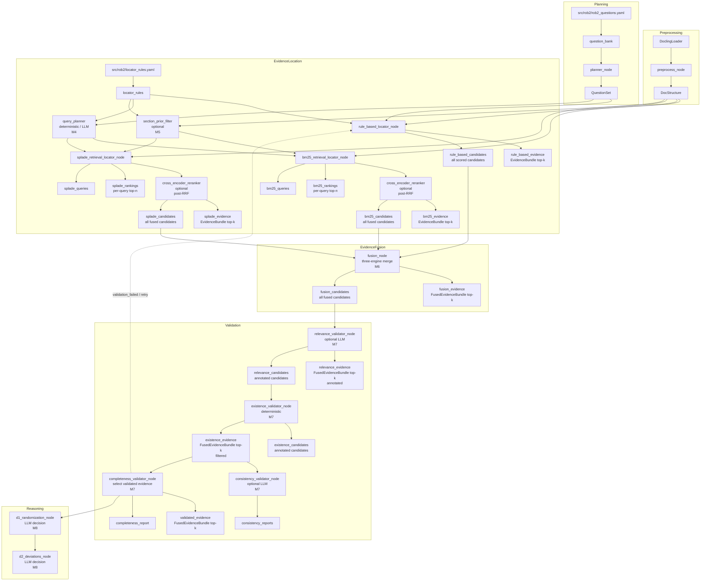

# System UML (Current Implementation)

Notes:
- This diagram reflects the currently implemented nodes and data flow in code.
- Evidence location currently includes rule-based, BM25, and SPLADE retrieval locators.
- `bm25_retrieval_locator_node` / `splade_retrieval_locator_node` support LLM query planning via LangChain `init_chat_model` (`query_planner=llm`), with deterministic fallback on errors.
- `bm25_retrieval_locator_node` / `splade_retrieval_locator_node` support optional cross-encoder reranking (`reranker=cross_encoder`) after RRF.
- `bm25_retrieval_locator_node` / `splade_retrieval_locator_node` support optional structure-aware filtering/ranking (Milestone 5).
- `relevance_validator_node` annotates fused candidates with an LLM relevance verdict (Milestone 7).
- `existence_validator_node` verifies paragraph_id/text/quote grounding against `doc_structure` (Milestone 7).
- `consistency_validator_node` optionally checks multi-evidence contradictions per question (Milestone 7).
- `completeness_validator_node` selects `validated_evidence` from candidates that passed validations (Milestone 7).
- Validation failures can trigger a retry that rolls back to the evidence location layer (Milestone 7).
- Dense/fulltext locators, remaining validation layers, D3-D5 reasoning, and aggregation are not implemented yet.
