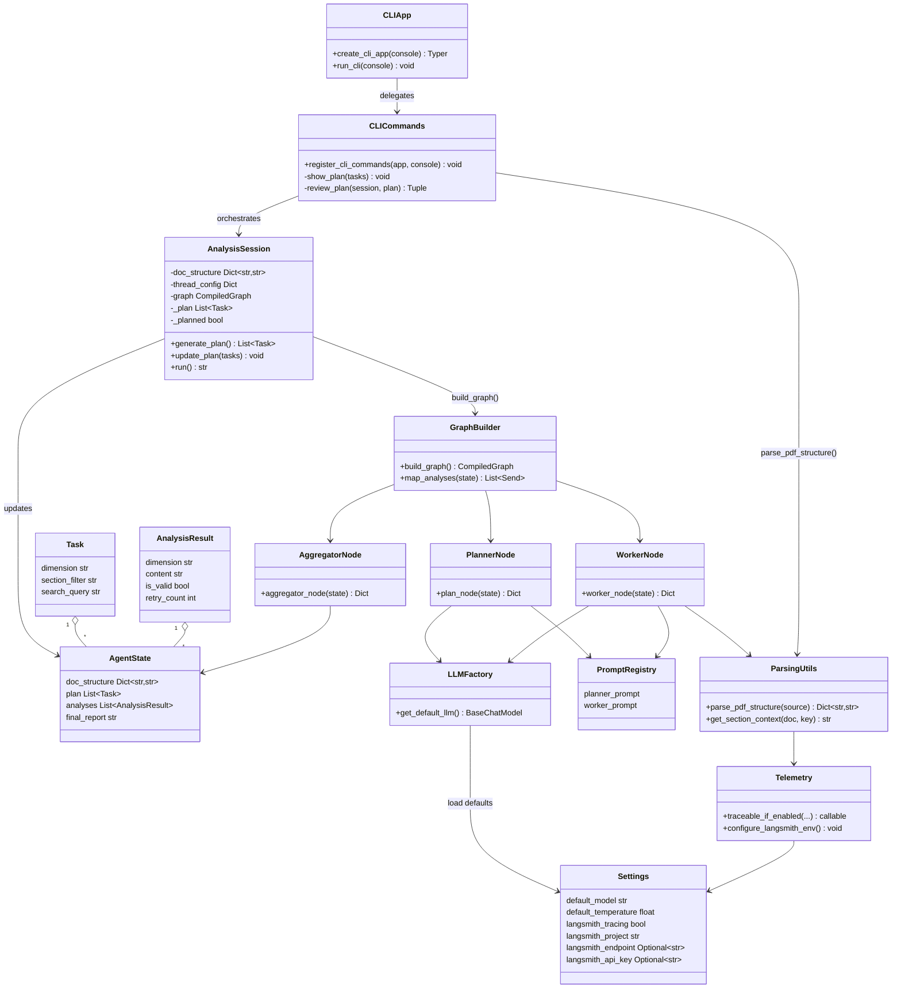

# System UML Diagram

The following Mermaid class diagram captures the major modules, data models, and runtime interactions across the CLI, LangGraph workflow, parsing utilities, and telemetry helpers.

Render with any Mermaid-compatible viewer (e.g., `npx @mermaid-js/mermaid-cli -i docs/system-uml.md -o diagram.svg`).
