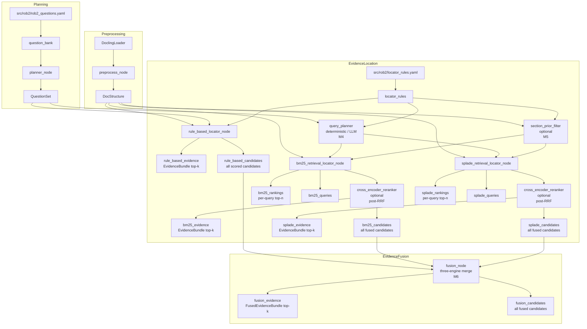

# System UML (Current Implementation)

Notes:
- This diagram reflects the currently implemented nodes and data flow in code.
- Evidence location currently includes rule-based, BM25, and SPLADE retrieval locators.
- `bm25_retrieval_locator_node` / `splade_retrieval_locator_node` support LLM query planning via LangChain `init_chat_model` (`query_planner=llm`), with deterministic fallback on errors.
- `bm25_retrieval_locator_node` / `splade_retrieval_locator_node` support optional cross-encoder reranking (`reranker=cross_encoder`) after RRF.
- `bm25_retrieval_locator_node` / `splade_retrieval_locator_node` support optional structure-aware filtering/ranking (Milestone 5).
- Dense/fulltext locators, validation, reasoning, and aggregation are not implemented yet.
